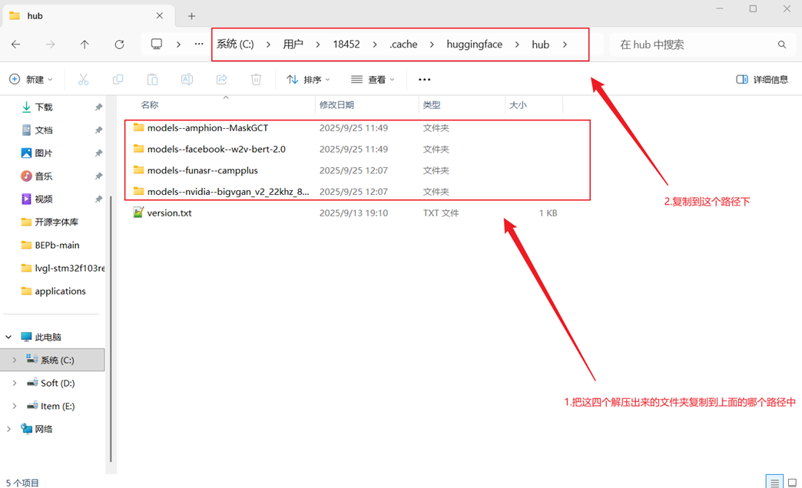

# <font size=4>B站开源文本转语音IndexTTS项目</font>

## <font size=3>一、安装 ffmpeg</font>

<font size=2>

> [!info]
> ℹ️ FFmpeg是一个开源的多媒体框架，能够记录、转换和流媒体处理音视频数据，它包含了一系列的工具和库，支持大量的多媒体格式，并能在不同的操作系统上运行，包括Windows、MacOS和Linux等。
>
> [📑Windows安装FFmpeg](./Windows安装FFmpeg.md)

</font>

## <font size=3>二、安装 Miniconda</font>

<font size=2>

> [!info]
> ℹ️ Conda 是一个开源的软件包管理和环境管理系统，适用于多种语言（如Python、R等），主要用于数据科学，机器学习等领域。它不仅能够帮助用户安装和管理软件包，还能创建和管理独立的运行环境，以便于处理不同项目间的依赖关系冲突。Conda通过其强大的依赖解析能力，可以确保安装的所有软件包和谐共存。
> ▪️ 跨平台支持：可在Windows、macOS和Linux上使用。
> ▪️ 环境管理：允许用户轻松创建、导出、列出和移除虚拟环境。
> ▪️ 包管理：提供从Anaconda仓库及其他第三方源中搜索、安装和更新软件包的能力。
> ▪️ 依赖解决：自动解决软件包之间的依赖关系。
>
> **Miniconda 是 Conda 的一个最小发行版本，仅包含Conda包管理和Python解释器，没有预装任何其他软件包**。他是获取Conda功能的一种轻量级方式，让用户可以从头开始构建自己的软件包集合和环境。
>
> ▪️ 轻量化安装：相比于完整版的Anaconda，Miniconda的安装文件小得多，因为它只包含了最基本的功能。
> ▪️ 灵活性：用户可以根据需要自行选择要安装的软件包，而不是一开始就安装大量可能用不到的软件包。
> ▪️ 全面兼容：尽管是精简版，但Miniconda仍然提供了全部的Conda功能，包括环境和包管理能力。

[📑Windows安装 miniconda](./Windows安装Miniconda.md)

</font>

## <font size=3>三、创建项目conda环境</font>

<font size=2>

```bash
#先创建index-tts项目环境同时配置指定版本的Python环境
conda create -n index-tts-2 python=3.10
#再激活这个项目环境
conda activate index-tts-2
```

</font>

## <font size=3>四、安装 Pynini</font>

<font size=2>

> [!info]
> ℹ️ Pynini 是一个基于开源的有限状态转换器(Finite-State Transducer, FST)库——OpenFst 的 Python 绑定。它允许用户在Python环境中利用有限状态机的强大功能进行字符串处理、自然语言处理(NLP)等任务。Pynini特别适用于需要复杂规则和转换的应用场景，例如拼音纠正、形态分析、语音识别中的语言模型构建等。
>
> 在语音识别合成系统中 **Pynini可用于开发语音模型，帮助提高识别准确率或生成更加自然的声音输出**

```bash
#代码块
conda install pynini==2.1.6
pip config set global.index-url https://pypi.tuna.tsinghua.edu.cn/simple
pip install WeTextProcessing --no-deps
```

</font>

## <font size=3>五、安装 PyTorch</font>

<font size=2>

> [!info]
> ℹ️ **PyTorch 是一个开源的机器学习库** ，主要用于自然语言处理、计算机视觉等领域中的应用，是学术界和工业界 **广泛使用的深度学习框架之一**。

[📑安装 PyTorch](./安装Pytroch.md)

</font>

## <font size=3>六、下载代码和安装依赖</font>

<font size=2>

> [!warning]
> 特此说明，本博是参照`FutureAI实验室`的教程进行本地部署的，该up对官方代码进行了修改优化，因此本博完全照搬该播主的部署方法，将需要的小模型以及webui的启动代码上传到github中，需要的直接fork即可。

```bash
# <font size=4>webui.py的相关代码</font>
https://github.com/young-nights/index-tts-2-controllable-system.git
```
在下载完项目代码后，通过`anaconda prompt`进入到项目代码路径，然后安装依赖

```bash
#切换盘符
i：
#进入项目代码路径
cd I:\Github-open-source-code\index-tts-2
#安装依赖
pip install -r requirements.txt
```

</font>

## <font size=3>七、模型下载</font>

<font size=2>

**IndexTTS-2.0**

```bash
modelscope download --model IndexTeam/IndexTTS-2 --local_dir checkpoints
```

**下载依赖小模型**
除了上述主模型，IndexTTS-2还依赖⼀些⼩模型，这些模型需要从**HuggingFace**载，本博将所需的小模型上传到百度网盘中，供需要时取用。

```bash
通过网盘分享的文件：小模型
链接: https://pan.baidu.com/s/1u7tSx4FtzGnG6M6pG8ddvg?pwd=kjmz 提取码: kjmz 
--来自百度网盘超级会员v9的分享
```



将解压得到的文件复制到如下的C盘文件夹路径中

```bash
C:\Users\{你⾃⼰的⽤⼾名}\.cache\huggingface\hub
```

</font>

## <font size=3>九、启动Web界面</font>

<font size=2>

**IndexTTS-2.0**

```bash
python webui.py
```

</font>
