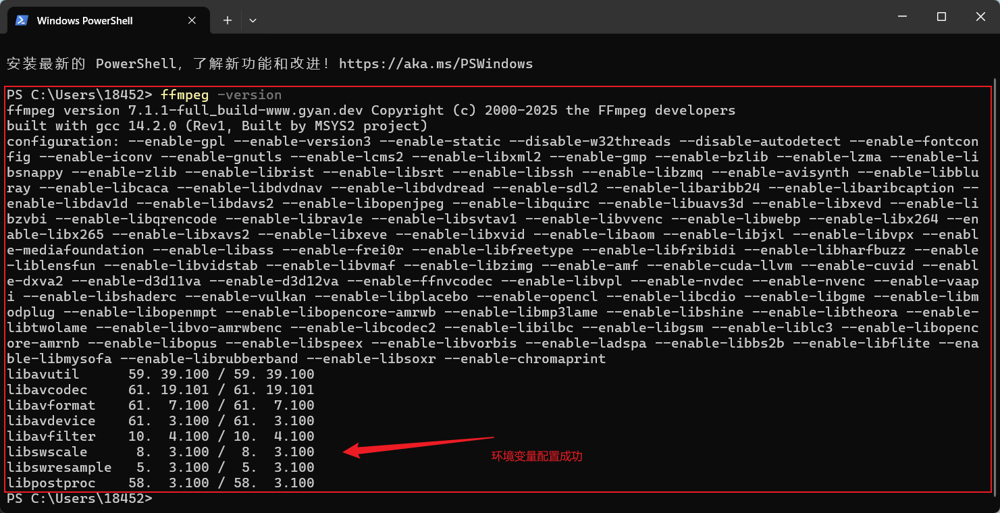

**ffmpeg配置步骤**

**1. 下载**

[FFmpeg下载链接](http://https://www.gyan.dev/ffmpeg/builds/packages/ffmpeg-7.1.1-full_build.7z "FFmpeg下载链接")

**2. 配置环境变量**

将 ffmpeg/bin 目录增加到 Path 环境变量中

**3. 验证安装**

在命令提示符中输入`ffmpeg -version`

