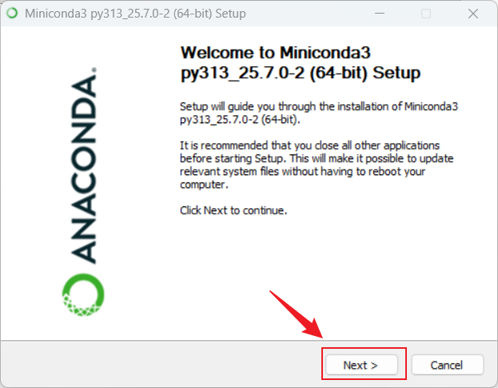
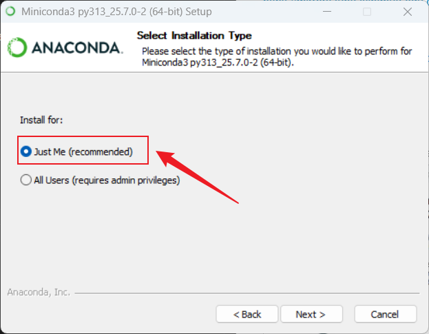
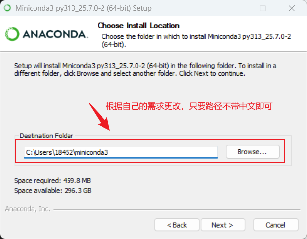
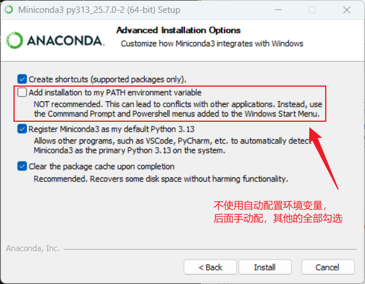
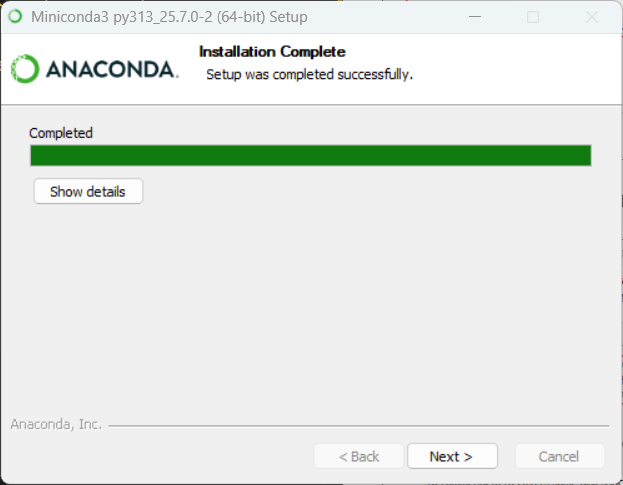
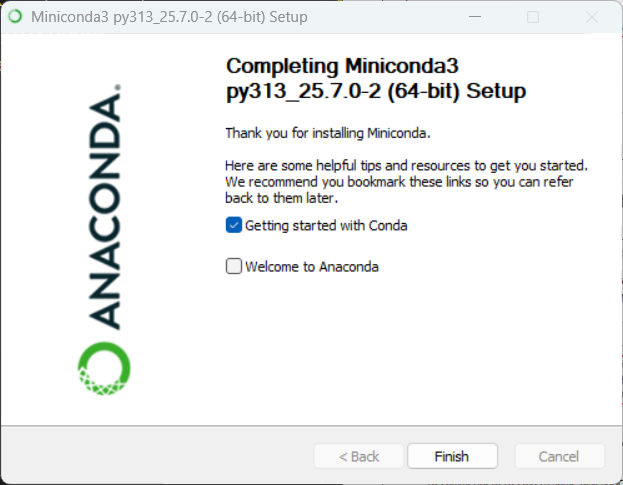
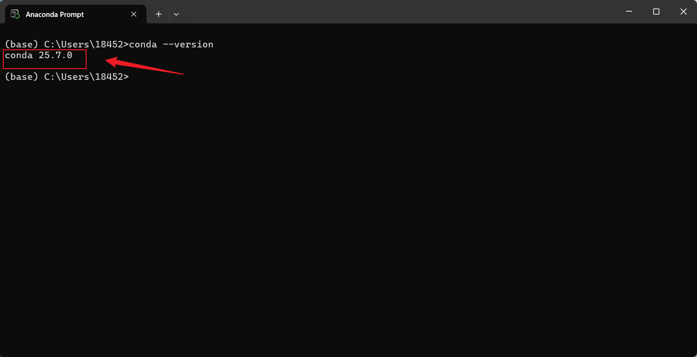

# <font size=4>Windows安装 miniconda</font>

## <font size=3>一、下载</font>

<font size=2>

**下载网址**
▪️官方网址：https://repo.anaconda.com/miniconda/
▪️清华镜像：https://mirrors.tuna.tsinghua.edu.cn/anaconda/miniconda/

🏷️**下载版本**
Miniconda3-latest-Windows-x86_x64.exe

</font>

## <font size=3>二、安装</font>

<font size=2>

双击下载的.exe按照引导步骤操作即可



选择仅为我安装


自定义路径，这里推荐使用默认


勾选特殊功能，这里除了第二个自动配置环境变量不勾选，其他全勾选


等待安装完成


安装完成


</font>

## <font size=3>三、打开Anaconda Prompt</font>

<font size=2>

> [!warning]
> ⚠️ 由于在安装的时候没有将 miniconda 添加到环境变量中(官方不推荐添加环境变量)，需要在 anaconda prompt 中使用 conda 命令。

在计算机上搜索【Anaconda Prompt】并打开，输入 `conda --version` 查看版本，出现类似下图页面，表示安装完成。



</font>

## <font size=3>四、镜像设置</font>

<font size=2>

> [!warning]
> 在中国，由于网络环境的原因，访问默认的 Conda 资源库可能会比较慢，为了加快下载速度，可以设置国内的镜像源。

在 Anaconda Prompt 中依次输入下方代码配置：

```bash
conda config --add channels https://mirrors.ustc.edu.cn/anaconda/pkgs/main
conda config --add channels https://mirrors.ustc.edu.cn/anaconda/pkgs/free
conda config --add channels https://mirrors.ustc.edu.cn/anaconda/cloud/conda-forge
conda config --add channels https://mirrors.ustc.edu.cn/anaconda/cloud/msys2
conda config --add channels https://mirrors.ustc.edu.cn/anaconda/cloud/bioconda
conda config --set show_channel_urls yes
```

`--set show_channel_urls yes`是用来在安装包时显示从哪个源获取了包。

**删除镜像源**

```bash
conda config --remove-key channels
```

**查看镜像列表**

```bash
conda config --show channels
```

</font>
