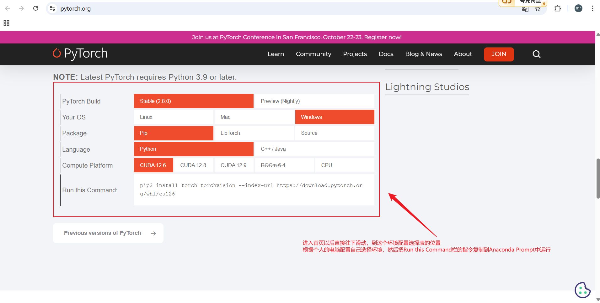
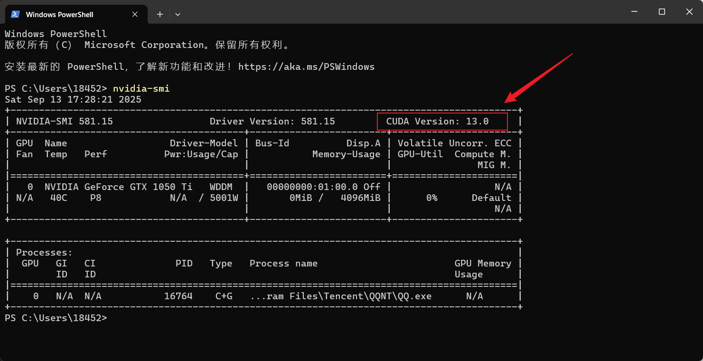

# <font size=4>安装Pytroch</font>

## <font size=3>一、安装过程</font>

### <font size=2>1.1 访问官网选择环境</font>

<font size=2>

**官网地址**
https://pytorch.org



**CPU版本**

```bash
#代码块
pip3 install torch torchvision torchaudio
```

**查看本机的CUDA版本**
如果电脑配置有NVIDIA GPU,更新显卡驱动到最新版本(可通过NVIDIA APP更新),然后执行`nvidia-smi`,查看允许安装的最大CUDA版本号,不可安装大于此处显示的CUDA,比如下图,允许安装的最大CUDA版本号是 13.0

```bash
# <font size=4>选择CUDA版本之前,先打开电脑的 命令提示符 运行下列代码</font>
nvidia-smi
```



</font>

### <font size=2>1.2 环境变更</font>

<font size=2>

假如电脑的显卡版本降低了,CUDA支持的最大版本就变小了,此时需要卸载当前这个超过最大版本的CUDA

```bash
# <font size=4>1. 先激活对应环境</font>
conda activate index-tts

# <font size=4>2. 查看当前PyTorch安装的CUDA版本号</font>
python -c "import torch; print(torch.version.cuda)"

# <font size=4>3. 卸载 PyTorch 及附带的所有 nvidia-* 库(这里以安装过CUDA-12.9版本为例)</font>
# <font size=4>pip uninstall -y torch torchvision torchaudio nvidia-cublas-cu129 nvidia-cuda-cupti-cu129 nvidia-cuda-nvrtc-cu129 nvidia-cuda-runtime-cu129 nvidia-cudnn-cu129 nvidia-cufft-cu129 nvidia-curand-cu129 nvidia-cusolver-cu129 nvidia-cusparse-cu129 nvidia-nccl-cu129 nvidia-nvtx-cu129</font>
pip uninstall -y torch torchvision torchaudio nvidia-cublas-cu129 nvidia-cuda-cupti-cu129 \
                 nvidia-cuda-nvrtc-cu129 nvidia-cuda-runtime-cu129 nvidia-cudnn-cu129 \
                 nvidia-cufft-cu129 nvidia-curand-cu129 nvidia-cusolver-cu129 \
                 nvidia-cusparse-cu129 nvidia-nccl-cu129 nvidia-nvtx-cu129

# <font size=4>4.再用 pip list | grep nvidia 确认无残留，就回到"无 PyTorch 私有 CUDA"状态。</font>
pip list | grep nvidia
```

</font>
