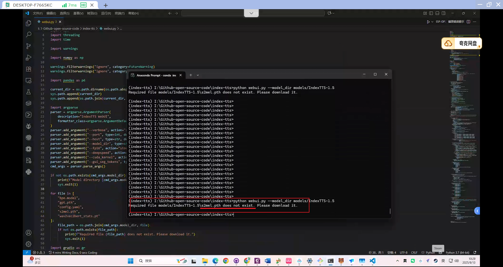
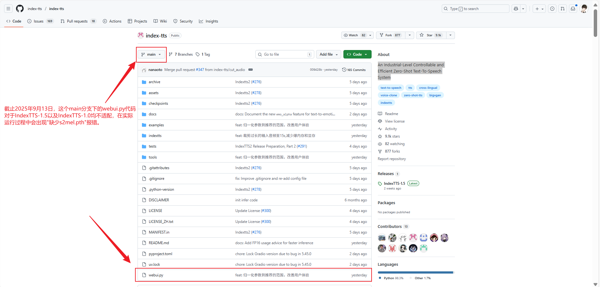
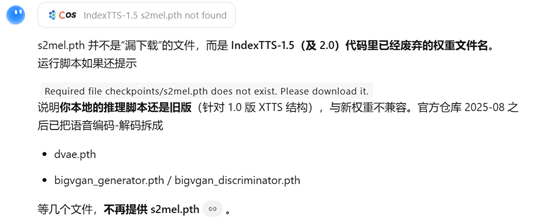
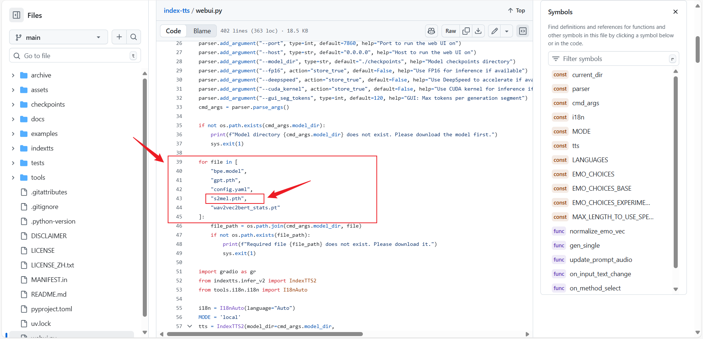
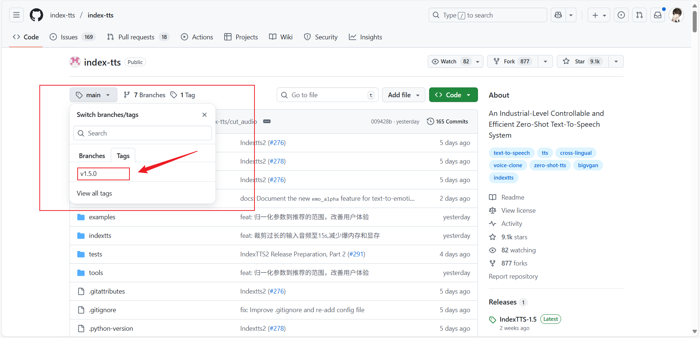
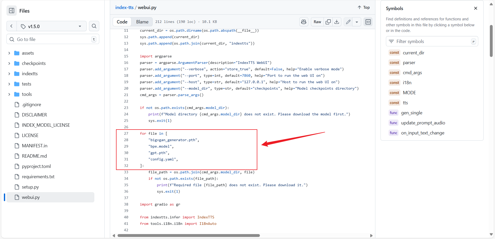

**在下载Index-TTS的Web端控制系统时出现运行模型缺少"s2mel.pth"文件报错**

--------

**问题排查**

首先询问kimi，给出的回答是IndexTTS-1.5（及 2.0）代码里已经废弃的权重文件名，本地的推理脚本还是旧版（针对 1.0 版 XTTS 结构），与新权重不兼容。官方仓库 2025-08 之后已把语音编码-解码拆成`dvae.pth`、`bigvgan_generator.pth`、`bigvgan_discriminator.pth`这几个文件，不再提供`s2mel.pth`

--------

问题得不到解决，然后查询github分支下的`webui.py`文件，发现在`main`分支下的`webui.py`文件的第39~40行出现关于.pth文件的配置

然后发现在main分支下的tag中有一个1.5.0版本的代码

进入这个代码，打开`webui.py`文件，发现在低27~32行出现关于.pth文件的配置

**==改用v1.5.0版本的代码，再运行程序，程序运行正常==**