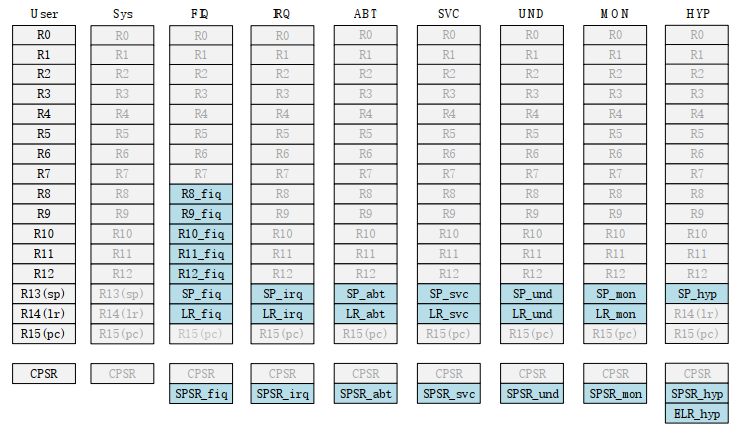
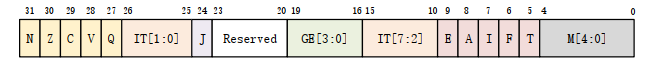

# IMX6ULL启动方式
## 一、设置IMX6ULL的Cortex-A处理器模式

Cortex-A7（也就是 i.MX6ULL 所用的内核）属于 ARMv7-A 架构，它拥有9种处理器模式。

| 序号 | 模式名称   | 模式编码 | 特权级别    | 何时进入这个模式                                     | 主要用途                                             |
| ---- | ---------- | -------- | ----------- | ---------------------------------------------------- | ---------------------------------------------------- |
| 1    | User       | 0b10000  | 非特权      | 普通应用程序运行                                     | 运行 Linux 用户进程、裸机应用主循环                  |
| 2    | System     | 0b11111  | 特权（PL1） | 只有用 privileged 指令才能进（Linux 内核主要用这个） | Linux 内核态代码运行的地方（和 User 用同一套寄存器） |
| 3    | Supervisor | 0b10011  | 特权（PL1） | SVC/SMC/HVC 指令、复位、上电                         | 系统调用（syscall）、异常入口、内核启动              |
| 4    | IRQ        | 0b10010  | 特权（PL1） | 普通硬件中断                                         | 所有外设中断处理（i.MX6ULL 99% 的中断都走这里）      |
| 5    | FIQ        | 0b10001  | 特权（PL1） | 快速硬件中断（需专门接线）                           | 几乎没人用（i.MX6ULL 没接 FIQ 线）                   |
| 6    | Abort      | 0b10111  | 特权（PL1） | 预取指令失败或数据访问失败（页面错误）               | 段错误、MMU 缺页异常                                 |
| 7    | Undefined  | 0b11011  | 特权（PL1） | 执行未定义指令                                       | 非法指令、协处理器不存在等                           |
| 8    | Monitor    | 0b10110  | 特权（PL1） | 执行 SMC 指令（Secure Monitor Call）                 | TrustZone 安全世界与普通世界的切换入口               |
| 9    | Hyp        | 0b11010  | 特权（PL2） | 执行 HVC 指令，或虚拟化异常                          | 运行 Hypervisor（虚拟机管理器），KVM/QEMU 用这里     |

除了 User(USR)用户模式以外，其它 8 种运行模式都是特权模式。这几个运行模式可以通过软件进行任意切换，也可以通过中断或者异常来进行切换。大多数的程序都运行在用户模式，用户模式下是不能访问系统所有资源的，有些资源是受限的，要想访问这些受限资源就必须进行模式切换。但是用户模式是不能直接进行切换的，用户模式下需要借助异常来完成模式切换，当要切换模式的时候，应用程序可以产生异常，在异常的处理过程中完成处理器模式切换。
当中断或者异常发生以后，处理器就会进入到相应的异常模式种，每一种模式都有一组寄存器供异常处理程序使用，这样的目的是为了保证在进入异常模式以后，用户模式下的寄存器不会被破坏。

ARM 架构提供了18个寄存器，Cortex-A7 有 9 种运行模式，每一种运行模式都有一组与之对应的寄存器组。

**程序状态寄存器（CPSR）**
所有的处理器模式都共用一个 CPSR 物理寄存器，因此 CPSR 可以在任何模式下被访问。

| 位    | 名称         | 含义                                                  | 取值及意义                                                           |
| ----- | ------------ | ----------------------------------------------------- | -------------------------------------------------------------------- |
| 31    | N (Negative) | 负标志                                                | 1 = 负，0 = 非负                                                     |
| 30    | Z (Zero)     | 零标志                                                | 1 = 为零，0 = 不为零                                                 |
| 29    | C (Carry)    | 进位/借位标志（无符号加减法最后一次产生进位或借位）   | 1 = 产生进位/无借位，0 = 无进位/有借位                               |
| 28    | V (Overflow) | 有符号溢出标志（有符号加减法发生溢出）                | 1 = 溢出，0 = 无溢出                                                 |
| 27    | Q            | 饱和标志（DSP 扩展指令 USAT、SSAT 等使用）            | 1 = 发生饱和，0 = 未饱和                                             |
| 26~25 | IT[1:0]      | 和 IT[7:2]一起组成 IT[7:0]，作为 IF-THEN 指令执行状态 |                                                                      |
| 24    | J            | Jazelle 字节码状态位                                  | [J:T] = [0:0] (ARM)，[0:1] (Thumb)，[1:1] (ThumbEE)，[1:0] (Jazelle) |
| 28    | GE[3:0]      | SIMD 指令有效，大于或等于                             |                                                                      |
| 27    | IT[7:2]      | 参考 IT[1:0]                                          |                                                                      |
| 28    | E            | 数据端序位（大端/小端）                               | 0 = Little-endian，1 = Big-endian（i.MX6ULL 几乎都用小端）           |
| 27    | A            | 异步异常屏蔽（Async Abort mask）                      | 1 = 屏蔽外部 Abort（Data Abort），0 = 允许（Linux 一般置 1）         |
| 28    | I            | IRQ 中断屏蔽位                                        | 1 = 禁止 IRQ 中断，0 = 允许（开中断时清 0，关中断时置 1）            |
| 27    | F            | FIQ 中断屏蔽位                                        | 1 = 禁止 FIQ，0 = 允许（i.MX6ULL 基本不用 FIQ，所以一般都置 1）      |
| 28    | T            | Thumb 状态位                                          | [J:T] = [0:0] (ARM)，[0:1] (Thumb)，[1:1] (ThumbEE)，[1:0] (Jazelle)     |
| 27    | M[4:0]       | 处理器模式控制位                                      | 详见9种处理器模式                                                    |

## 二、设置IMX6ULL的Cortex-A的启动方式

i.MX6ULL（以及整个 i.MX6 系列）处理器上电后的启动模式（Boot Mode） 由两个引脚 BOOT_MODE[1:0] 决定，一共有 4 种模式，但实际开发中最常用的是前两种。

| BOOT_MODE1 | BOOT_MODE0 | 模式名称          | 实际用途与行为                                                                                                   | 典型使用场景                    |
| ---------- | ---------- | ----------------- | ---------------------------------------------------------------------------------------------------------------- | ------------------------------- |
| 0          | 0          | Boot From Fuses   | 完全按照芯片内部 eFuse 烧录的配置启动                                                                            | 量产出厂的最终产品              |
| 0          | 1          | Serial Downloader | 进入串口下载模式（USB OTG 或 UART），等待 PC 端工具（如 imx_usb_loader、UUU、mfgtools）下载程序到 RAM 或直接烧写 | 开发、调试、烧录eMMC/NAND、救砖 |
| 1          | 0          | Internal Boot     | 最常用的正常启动模式，按照芯片eFuse + BOOT_CFG引脚 决定的外设启动（如SD卡、eMMC、NAND、QSPI NOR等）              | 开发板、产品开发、最终量产      |
| 1          | 1          | 保留（Reserved）  | 官方保留，某些芯片公司可能有特殊功能，一般不要使用                                                               | 基本不用                        |

