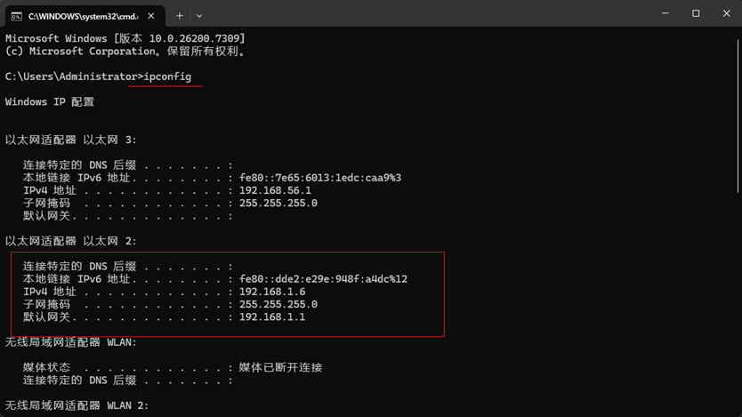
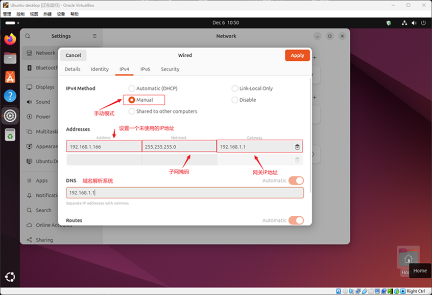
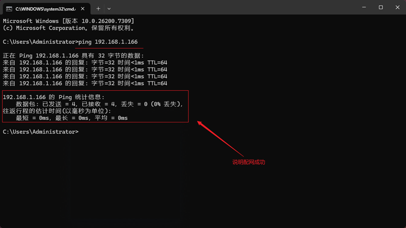
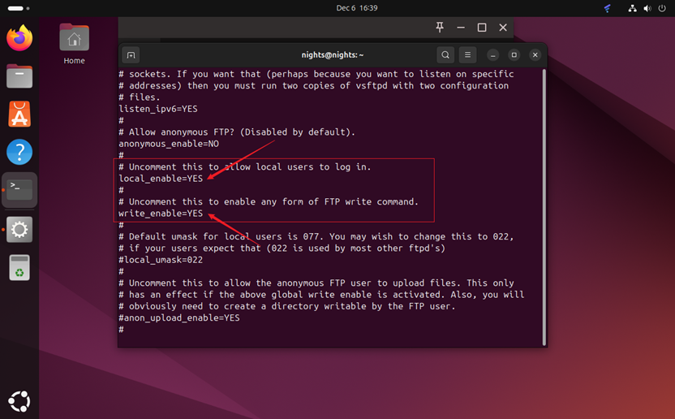
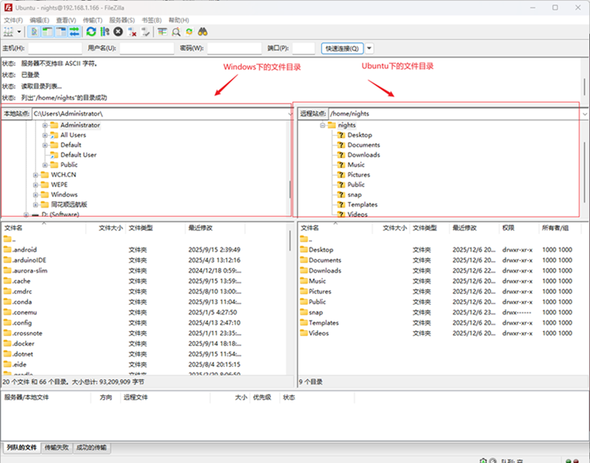
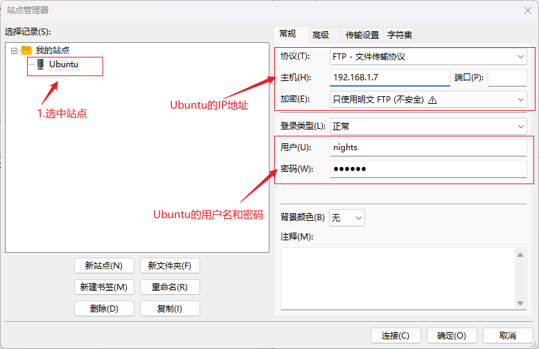
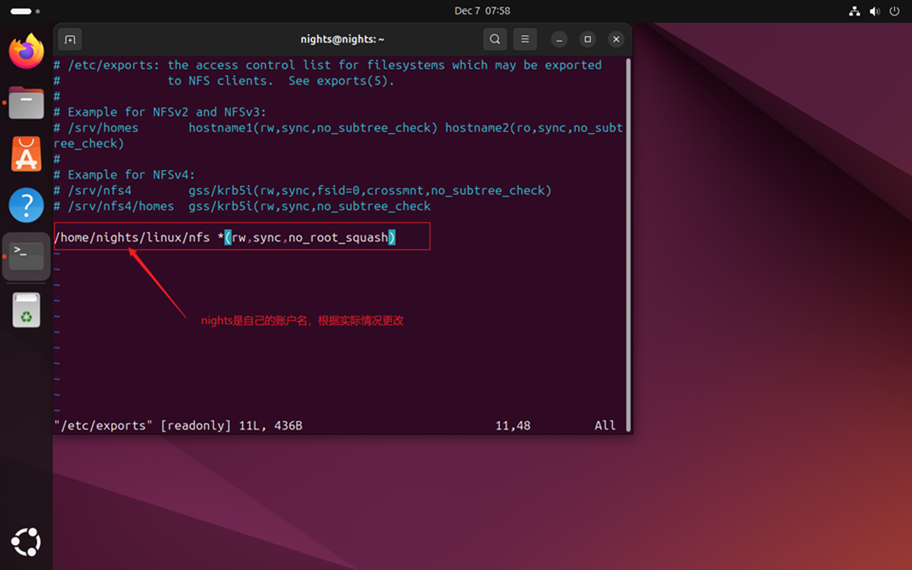
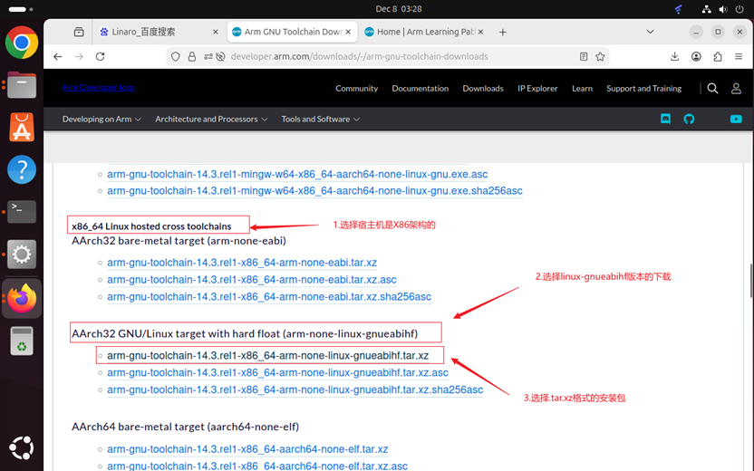
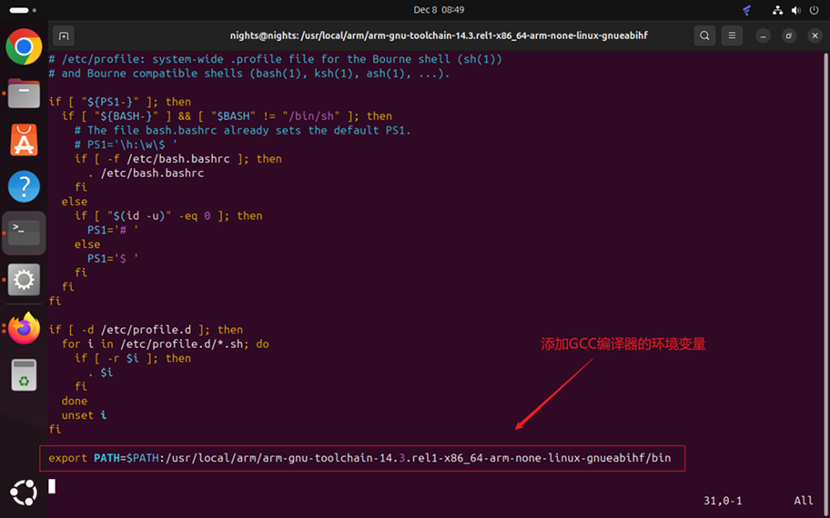

<style>
.highlight{
  color: white;
  background: linear-gradient(90deg, #ff6b6b, #4ecdc4);
  padding: 5px;
  border-radius: 5px;
}

.mint_green{
  color: white;
  background: #adcdadf2; 
  padding: 5px;
  border-radius: 5px;
}

.red {
  color: #ff0000;
}
.green {
  color:rgb(10, 162, 10);
}
.blue {
  color:rgb(17, 0, 255);
}

.wathet {
  color:rgb(0, 132, 255);
}
</style>


# <span class="wathet"><font size=4>Ubuntu初始软件配置与安装</font></span>
## <font size=3>一、软件安装</font>
<font size=2>

```bash
# Git安装
sudo apt install git

# vim安装
sudo apt install vim
```

</font>

---

## <font size=3>二、网络配置</font>
<font size=2>

ℹ️ Ubuntu 虚拟机的网络是通过 Virtual Box 与 Windows 电脑进行本地桥接得到的，在使用 Ubuntu（主要是 VirtualBox 虚拟机）中配置网络时，主要有以下几种选择：

| 网络模式              | 是否能上网（访问外部网络） | 虚拟机之间能否互相通信   | 宿主机能否访问虚拟机 | 外部网络能否访问虚拟机   | 典型用途场景                               | 实现原理简述                                |
| --------------------- | -------------------------- | ------------------------ | -------------------- | ------------------------ | ------------------------------------------ | ------------------------------------------- |
| 网络地址转换(NAT)     | 可以（默认）               | 不可以                   | 可以（需端口转发）   | 不可以（需手动端口转发） | 日常学习、测试、上网最简单                 | 虚拟机通过宿主机做 NAT 转换上网             |
| 桥接网卡(Bridged)     | 可以                       | 可以（同一局域网）       | 可以                 | 可以                     | 虚拟机需要被局域网其他设备访问（如服务器） | 虚拟机直接连到物理网卡，获得真实局域网 IP   |
| NAT 网络(NAT Network) | 可以                       | 可以（同一 NAT 网络内）  | 可以（需端口转发）   | 不可以                   | 多虚拟机互访 + 共享上网，比桥接更安全      | NAT + 虚拟交换机，所有虚拟机在一个子网      |
| 仅主机(Host-Only)     | 不可以                     | 可以                     | 可以                 | 不可以                   | 宿主机与虚拟机互访，不需要外网             | VirtualBox 创建私有网段（默认192.168.56.x） |
| 内部网络(Internal)    | 不可以                     | 可以（同一内部网络名称） | 不可以               | 不可以                   | 多虚拟机完全隔离的私有网络测试             | 纯虚拟交换机，连宿主机都访问不到            |
| 通用驱动(Generic)     | 取决于子模式               | 取决于子模式             | 取决于子模式         | 取决于子模式             | 极少使用（UDPTunnel、VDE 等特殊场景）      | 共享驱动模式，几乎没人用                    |
| 云网络(Cloud)         | 可以（通过云端网络）       | 视云厂商网络而定         | 通常不可以           | 视配置而定               | 直接管理 Oracle Cloud 等云实例             | VirtualBox 6.1+ 新增，连接云 VM             |

ℹ️ 各个模式默认IP范围：

| 模式      | 默认网段           | 网关/DHCP                     | 备注                        |
| --------- | ------------------ | ----------------------------- | --------------------------- |
| NAT       | 10.0.2.0/24        | 10.0.0.2（宿主机）            | 每个虚拟机独立              |
| NAT网络   | 10.0.2.0/24(可改)  | 有 DHCP，可自定义             | 多个虚拟机共享同一网段      |
| 桥接      | 与宿主机同一局域网 | 路由器DHCP                    | 如 192.168.1.x、192.168.0.x |
| Host-Only | 92.168.56.0/24     | 宿主机 192.168.56.1 提供 DHCP | VirtualBox 自动创建虚拟网卡 |
| 内部网络  | 无（需手动设置）   | 无 DHCP，需手动配 IP          | 完全由用户定义              |

ℹ️ 快速选择推荐：

| 需求                                               | 推荐模式            | 理由                            |
| -------------------------------------------------- | ------------------- | ------------------------------- |
| 只是上网、写代码、测试软件                         | NAT（最省事）       | 开箱即用，不影响宿主机网络      |
| 虚拟机要被局域网其他电脑访问（如 Web、SSH 服务器） | 桥接网卡            | 虚拟机获得真实局域网 IP，最直接 |
| 多台虚拟机需要互相通信，同时一起上网               | NAT 网络            | 既能互访又能上网，比桥接更安全  |
| 宿主机 ↔ 虚拟机互访，但不连外网                    | 仅主机（Host-Only） | 自动分配私有网段，安全隔离      |
| 多台虚拟机构建完全隔离的测试网络                   | 内部网络            | 连宿主机都访问不到，最彻底隔离  |
| 虚拟机需要固定 IP 且局域网可访问                   | 桥接（首选）        | 最简单直接                      |

<span class="red">在进行嵌入式Linux开发时，需要保证 Ubuntu 与 Windows 和 开发板处于同一个网段中。因此，这里选择使用桥接的网络模式。</span>


```bash
# 在Windows的命令提示符中查看宿主机的IP地址，网关IP以及子网掩码等信息
ipconfig
```



**静态IPv4地址分配**



<span class="blue">设置完成后验证ip地址是否与宿主机桥接成功</span>

```bash
# 在Windows的命令提示符中ping通Ubuntu的网络
ping 192.168.1.166
```


</font>


---

## <font size=3>三、个性化配置</font>
<font size=2>


### <font size=2>终端颜色配置</font>

```bash
# 生成默认颜色配置：
						dircolors -p > ~/.dircolors
# 编辑颜色规则： 
						nano ~/.dircolors
# 找到DIR条目并修改：
						DIR 01;36  # 目录颜色：粗体 + 青色
# 加载配置到 ~/.bashrc：
						echo 'eval "$(dircolors ~/.dircolors)"' >> ~/.bashrc
						source ~/.bashrc

```

</font>


## <font size=3>四、Windows 和 Ubuntu 文件互传</font>
<font size=2>

**开启 Ubuntu 下的 FTP 服务**

1. 打开 Ubuntu 的终端窗口，然后执行如下命令来安装 FTP 服务
```bash
sudo apt-get install vsftpd
```

2. 等待软件自动安装，安装完成以后使用 VI 命令打开/etc/vsftpd.conf，命令如下
```bash
sudo vim /etc/vsftpd.conf
```

3. 打开 vsftpd.conf 文件以后找到如下两行
```bash
local_enable=YES
write_enable=YES
```

4. 确保上面两行前面没有“#”，有的话就取消掉，完成以后如图所示


5. 修改完 vsftpd.conf 以后保存退出，使用如下命令重启 FTP 服务
```bash
sudo /etc/init.d/vsftpd restart
```

**Windows 下FTP客户端安装**
1. Windows 下 FTP 客户端使用 FileZilla，这是个免费的 FTP 客户端软件，可以在 FileZilla 官网下载
[FileZilla官网下载链接](https://www.filezilla.cn/download)
<br>
2. FileZilla 软件界面


**FileZilla软件设置**
Ubuntu 作为 FTP 服务器， FileZilla 作为 FTP 客户端，客户端要连接到服务器上，打开站点管理器，点击：文件->站点管理器，打开以后如图所示。


</font>


## <font size=3>五、Ubuntu 下 NFS和SSH 服务开启</font>
<font size=2>

**NFS服务开启**
ℹ️ NFS（Network File System，网络文件系统）是一种由Sun Microsystems在1984年开发的分布式文件系统协议，允许客户端计算机像访问本地存储一样通过网络访问服务器上的文件。其核心目标是实现跨平台的共享存储，通过透明的远程文件访问简化数据管理。

```bash
# 安装NFS
sudo apt-get install nfs-kernel-server rpcbind
```
然后，在根目录下创建一个linux文件夹，在linux文件夹中在创建一个nfs文件夹，供nfs服务器使用，以后就可以在开发板上通过网络文件系统来访问nfs文件夹，在此之前，先配置nfs配置。

```bash
# 打开nfs配置文件
sudo vim /etc/exports
```

打开配置文件后，在文件内容的末尾添加`/home/nights/linux/nfs *(rw,sync,no_root_squash)`


```bash
# 重启nfs服务
sudo /etc/init.d/nfs-kernel-server restart
```


**SSH**
ℹ️ SSH（Secure Shell）是一种加密的网络协议，用于在不安全网络中安全地远程登录、执行命令、传输文件，甚至建立 VPN 隧道。它把传统 telnet/rsh 的明文通信全部换成强加密 + 完整性校验 + 身份认证，默认跑在 TCP 22 端口。
ℹ️ 开启 Ubuntu 的 SSH 服务以后就可以在 Windwos 下使用终端软件登陆到 Ubuntu，比如使用 SecureCRT， Ubuntu 下使用如下命令开启 SSH 服务。

<span class="red">ssh 的配置文件为 /etc/ssh/sshd_config ，使用默认配置即可</span>

```bash
# 更新apt
sudo apt update
# 自动确认并安装ssh服务
sudo apt install openssh-server -y
# 检查状态(应该显示active（running）)
sudo systemctl status ssh
# 如果没启动，手动启动
sudo systemctl start ssh
# 建议设置成开机启动
sudo systemctl enable ssh
# 如果没开ufw可以跳过这一步，一般桌面版默认没开启，服务器版有些会开启
# 允许ssh通过ufw防火墙
sudo ufw allow ssh
# 重启建议防火墙
sudo ufw reload
# 查询Ubuntu的IP地址
ip addr show | grep inet
hostname -I
```
</font>


## <font size=3>六、交叉编译工具链安装</font>

<font size=2>
Ubuntu 默认自带的编译器是基于X86框架的 GCC 编译器，现在需要编译ARM框架的代码，X86下的GCC编译器就不适用，因此需要安装一个运行在X86框架上的GCC编译器。<br>

Linaro官网链接：[Linaro下载链接](developer.arm.com/downloads/-/arm-gnu-toolchain-downloads)

从宿主机类别看，有以下几种类别：


解释：
- <span class="red">arm- </span> ： ARMv7及更早的32位构架(Cortex-A7/A9)
- <span class="red">aarch64- </span> ： ARMv8-A的64位构架，小端字节序(Cortex-A53/A72)
- <span class="red">aarch64_be- </span>：ARM64位构架，大端字节序
- <span class="red">none- </span> ： 无特定芯片生产厂商，通用版本
- <span class="red">gnueabihf</span>：GNU EABI硬浮点版本，使用FPU硬件加速浮点运算

本次使用的是基于Cortex-A7构架的I.MX6U多核处理器的开发板，因此此处使用`arm-none-linux-gnueabihf`版本的交叉编译器工具链。



下载完成以后，把交叉编译器工具链的包移动到`linux文件夹`下的`tool文件夹`中;

```bash
# 1.检查目标目录是否存在
ls -a ~/linux/tool

# 1.1 如果不存在，创建目标目录 
sudo mkdir ~/linux/tool

# 1.2 再次检查目录是否存在
ls -a ~/linux/tool 

# 2. 刚下载玩的包在Downloads文件夹中，移动到目标目录
mv ~/Downloads/文件名 ~/linux/tool
```

在Ubuntu的最上层的根目录中的`usr/local/`文件夹中创建`arm`文件夹，然后把工具链解压到这个`arm`文件夹中(这里默认已经创建好了，创建过程省略，直接移动+解压)

```bash
# 进入 /linux/tool 文件夹中，然后拷贝到 usr/local/arm 文件夹中
sudo cp arm-gnu-toolchain-14.3.rel1-x86_64-arm-none-linux-gnueabihf.tar.xz /usr/local/arm/ -f

# 解压工具链压缩包
sudo tar -vxf arm-gnu-toolchain-14.3.rel1-x86_64-arm-none-linux-gnueabihf.tar.xz

# 修改环境变量
sudo vim /etc/profile

# 打开 /etc/profile 以后，在文件末尾添加环境变量
export PATH=$PATH:/usr/local/arm/arm-gnu-toolchain-14.3-rel1-x86_64-arm-none-linux-gnueabihf/bin
```


重启Ubuntu后，验证交叉编译器

```bash
arm-none-linux-gnueabihf-gcc --version
```

</font>


## <font size=3>七、</font>
<font size=2>


</font>

