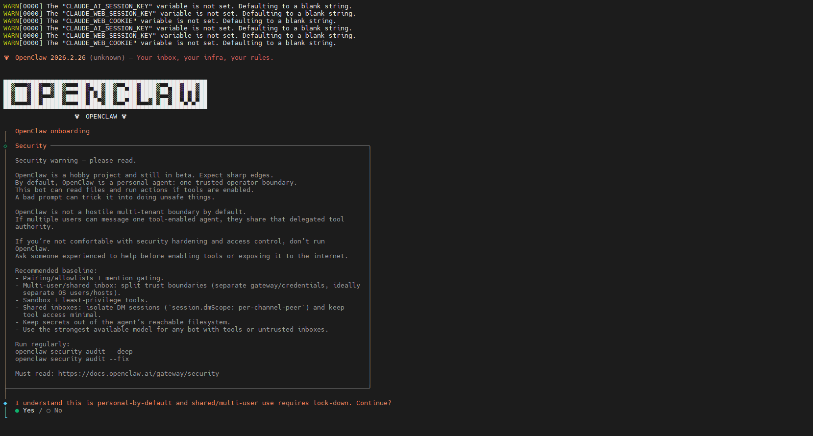
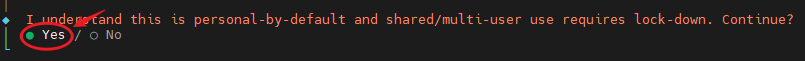
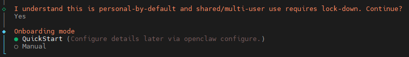
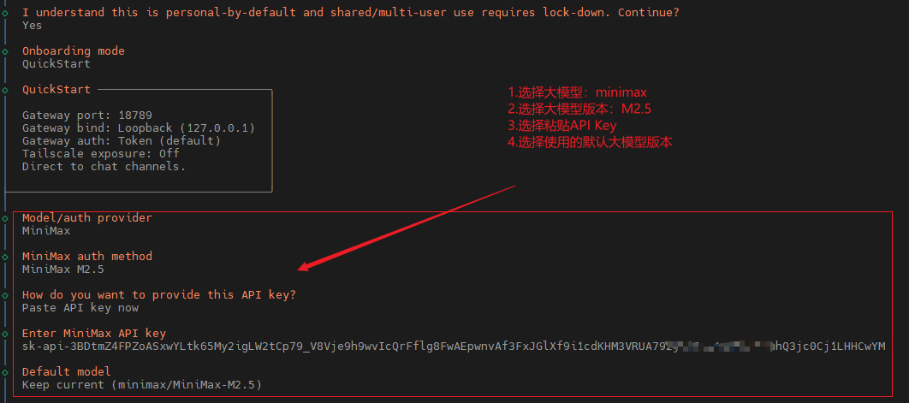
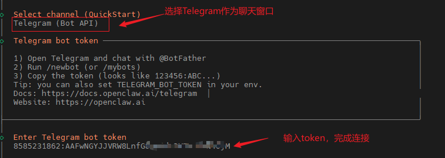
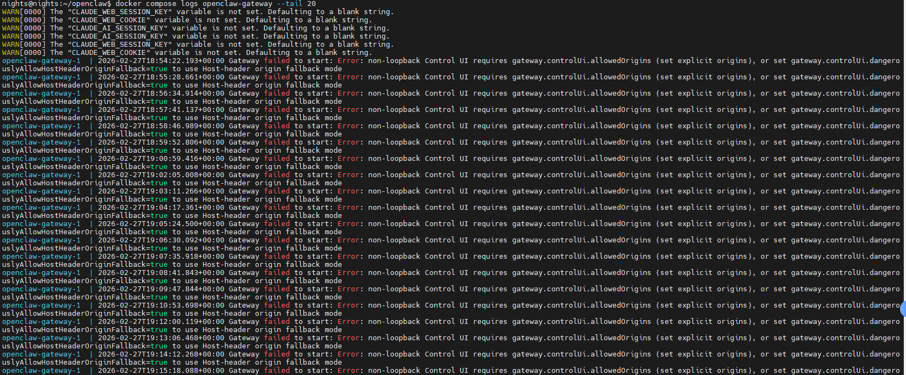
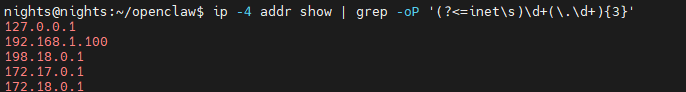
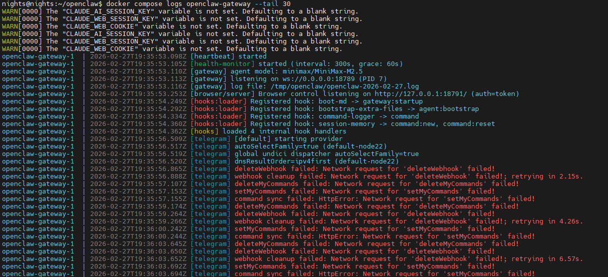
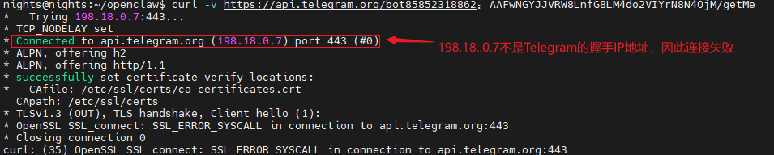
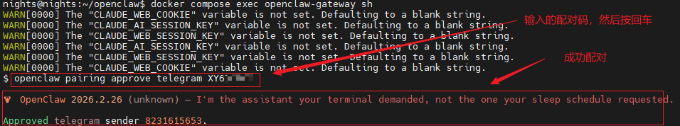

# <font size=4>OpenClaw的本地部署</font>

## <font size=3>Docker的安装</font>

### <font size=2>前置条件检查</font>

<font size=2>

```bash
# 1. 刷新本地 APT 软件源索引
sudo apt update

# 2. 安装4个关键工具
#     - ca-certificates ：提供 HTTPS 证书信任链（让 curl 等工具能安全访问 https 网站）
#     - curl            ：命令行下载工具，用于抓取 Docker 的 GPG 公钥
#     - gnupg           ：处理 GPG 密钥的工具（用于验证软件源签名，防止中间人攻击）
#     - lsb-release     ：查询当前 Ubuntu 发行版代号（如 focal），用于动态生成 repo 地址
sudo apt install -y ca-certificates curl gnupg lsb-release

# 3. 现代 APT（Ubuntu 20.04+）推荐把第三方源的 GPG 密钥统一放在这个目录下
sudo mkdir -p /etc/apt/keyrings

# 4. 这个密钥是 Docker 签名所有 deb 包的"身份证"。APT 用它验证下载的 docker-ce 等包是否被篡改
curl -fsSL https://download.docker.com/linux/ubuntu/gpg | sudo gpg --dearmor -o /etc/apt/keyrings/docker.gpg

# 5. 告诉 APT "去哪里找 Docker 的包"。没有这一步，系统不知道 Docker 包的存在
echo "deb [arch=$(dpkg --print-architecture) signed-by=/etc/apt/keyrings/docker.gpg] https://download.docker.com/linux/ubuntu $(lsb_release -cs) stable" | sudo tee /etc/apt/sources.list.d/docker.list > /dev/null

# 6. 第一次 update 的时候 Docker 源还没加，所以必须再跑一次才能看到 docker-ce 等包
sudo apt update

# 7. 真正安装 Docker
#     - docker-ce             ：Docker Engine 主程序（daemon）
#     - docker-ce-cli         ：命令行客户端（docker 命令）
#     - containerd.io         ：容器运行时（Docker 底层依赖）
#     - docker-compose-plugin ：Docker Compose v2 插件（就是我们需要的 docker compose 命令）
sudo apt install -y docker-ce docker-ce-cli containerd.io docker-compose-plugin


# 8. 验证版本
docker --version
docker compose version

# 9. 把当前用户加进 docker 组（避免每次 sudo）
sudo usermod -aG docker $USER
newgrp docker
```

</font>

### <font size=2>Docker Compose 安装</font>

<font size=2>

> [!warning]
> 如果之前系统上安装了docker，但是没有安装docker compose，就执行以下操作

```bash
# 1. 如果之前是用官方 Docker 仓库安装的 Docker（即有 /etc/apt/sources.list.d/docker.list 文件）
sudo apt update
sudo apt install docker-compose-plugin -y

# 2. 安装验证
docker compose version

# 3.  如果上面命令提示包找不到（常见于用 snap/apt install docker.io 安装的 Docker）
# 3.1 创建插件目录（针对当前用户）
mkdir -p ~/.docker/cli-plugins/

# 下载最新版 Compose v2 的二进制文件（amd64/x86_64 架构，大部分服务器都是这个）
# 可以去 https://github.com/docker/compose/releases 看最新版本，替换下面 v2.24.7 为当前最新
curl -SL https://github.com/docker/compose/releases/download/v2.24.7/docker-compose-linux-x86_64 -o ~/.docker/cli-plugins/docker-compose

# 赋予执行权限
chmod +x ~/.docker/cli-plugins/docker-compose

# 验证
docker compose version

```

</font>

## <font size=3>推荐部署方式：官方一键脚本（最简单）</font>

<font size=2>

```bash
# 克隆官方仓库（包含 docker-compose.yml 和 docker-setup.sh）
git clone https://github.com/openclaw/openclaw.git
cd openclaw

# 赋予执行权限并运行（会自动 build 镜像 + 运行 onboarding）
chmod +x docker-setup.sh
./docker-setup.sh
```

</font>



### <font size=2>1. 等待部署完成，进入onbaord配置</font>

<font size=2>

> [!warning]
> 这里选择Yes

</font>



<font size=2>

> [!warning]
> 重新进入 onboarding 界面

```bash
# 在配置过程中如果不小心退出了 onboarding 界面，输入以下命令，重新启动 onboarding
# --rm          ：跑完自动清理临时容器（干净）
# openclaw-cli  ：这是 docker-compose.yml 里定义的 CLI 服务名，用于跑 openclaw 命令
# onboard       ：就是 onboarding wizard 的子命令
docker compose run --rm openclaw-cli onboard

```

> [!warning]
> 选择QuickStart（快速开始）

</font>



<font size=2>

> [!warning]
> 选择大模型（推荐使用minimax）

这里需要说明的是,下方通过一系列验证，更正一下步骤2，选择`MiniMax M2.5(CN)`版本，同时更正一下步骤4，选择`minimax/MiniMax-M2.1`版本，测试通过，否则API_Key可能无法使用，这里可以对不同模型进行尝试，更正步骤为测试通过案例。

</font>



<font size=2>

> [!warning]
> 选择连接的设备用于对话

</font>



### <font size=2>2. 重启后的操作</font>

<font size=2>

> [!warning]
> 重新启动openclaw后台

```bash
# 1. 检查 Docker 是否运行
sudo systemctl status docker

# 2. 如果是 inactive/dead → 启动它
sudo systemctl start docker
sudo systemctl enable docker   # 设置开机自启（推荐）

# 3. 确认你的 OpenClaw 容器是否在运行
cd ~/openclaw   # 进入项目目录
docker compose ps

# 4. 启动 OpenClaw（不需要重新 onboarding）
docker compose up -d

```

</font>

### <font size=2>3. 对话失败问题点</font>

<font size=2>

> [!warning]
> 在openclaw启动后，利用Telegram对话无反应问题分析

</font>



<font size=2>

> [!info]
>
> **OpenClaw 的 Gateway  安全机制触发：**
>
> 1. OpenClaw 的 Gateway 默认会把 Control UI（网页控制面板，端口通常是 18789）绑定到 非 loopback 地址（即 LAN / 0.0.0.0 / 你的 VM IP），而不是只绑定 localhost。
>
> 2. 从 2026.2.23 版本左右开始，官方加强了安全检查：只要不是纯 loopback（127.0.0.1 / localhost）访问，就必须显式设置 gateway.controlUi.allowedOrigins，否则 Gateway 启动失败并循环重启。
>
> 3. 在 Ubuntu-server 虚拟机上用 Docker 部署，属于典型的远程/服务器环境，所以一定会触发这个错误（本地笔记本直接跑 Docker 才可能走 loopback）。

> [!warning]
> 在openclaw启动后，利用Telegram对话无反应问题解决

- 主要问题还是VPN没有开启，虚拟机开启后要检测一下VPN是否启动
- 进入你的 Docker Compose 目录（通常是 ~/openclaw）
- 查询你的 VM IP（浏览器要用这个 IP 访问）

```bash
ip -4 addr show | grep -oP '(?<=inet\s)\d+(\.\d+){3}'
```



```bash

# 127.0.0.1：这是本地回环地址（localhost），只在虚拟机自己内部有效。你从宿主机或别的机器浏览器访问时，浏览器 Origin 不会是这个。

# 192.168.1.100：这是虚拟机在局域网（LAN）里的真实 IP，通常是路由器分配给你的 VM 的地址。如果是从同一局域网的其他电脑/手机（比如日常用的 Windows/Mac/手机）访问 OpenClaw 的 Control UI（http://192.168.1.100:18789），浏览器发出的 Origin 就是 http://192.168.1.100:18789。所以必须允许它。

# 198.18.0.1：这是 RFC 2544 保留的测试/基准地址段（198.18.0.0/15），专门用于网络设备性能测试，不会用于真实网络通信。几乎可以确定是 Docker bridge 网络或其他虚拟网络接口的内部地址，不是你实际用来访问的 IP。

# 172.17.0.1 和 172.18.0.1：这是 Docker 默认 bridge 网络的网关地址（docker0 接口）。它们也只在容器内部或宿主机上可见，不是你从外面浏览器访问时会出现的 Origin。

```

- 设置允许的 Origins（把下面命令里的 <你的VM_IP> 换成实际 IP）：

```bash
# 模板
docker compose run --rm openclaw-cli config set \
  gateway.controlUi.allowedOrigins \
  '["http://<你的VM_IP>:18789","http://localhost:18789","http://127.0.0.1:18789"]' --strict-json

# 1. 本次测试执行
docker compose run --rm openclaw-cli config set \
  gateway.controlUi.allowedOrigins \
  '["http://192.168.1.100:18789", "http://localhost:18789", "http://127.0.0.1:18789"]' --strict-json

# 2. 重启 Gateway 容器
docker compose restart openclaw-gateway

# 3. 查看日志进行验证
docker compose logs openclaw-gateway --tail 20

```

</font>



<font size=2>

> [!tip]
>
> #### 解决Gateway问题后，产生 Telegram provider 初始化时反复失败问题
>
> 从上面的日志验证打印出来的信息可以看到，虽然解决了Gateway启动失败的问题，但是产生了 Telegram provider 初始化时反复失败的新问题，即，Telegram Bot API 的调用（通过 Node.js 的 fetch 或 undici）完全连不上 api.telegram.org，导致的网络请求失败，如下：
>
> ```text
> deleteWebhook failed: Network request for 'deleteWebhook' failed!
> setMyCommands failed: Network request for 'setMyCommands' failed!
> deleteMyCommands failed: ...
> command sync failed: HttpError: Network request for 'setMyCommands' failed!
> ```
>
> **问题分析**
>
> 1. 网络/DNS/防火墙阻挡
> 2. 没有设置 Telegram Bot Token
> 3. 代理未生效
>
> **测试方法**
>
> - 在宿主机（Ubuntu server）上跑下面命令测试能否连 Telegram API
>
> ```bash
> # 模板
> curl -v https://api.telegram.org/bot<你的TOKEN>/getMe
> # 替换 <你的TOKEN> 为实际 bot token，比如 123456:ABC-DEF1234ghIkl-zyx57W2v1u123ew11
>
> # 假设我的bot token
> # 85852xxxxxx：AAFwNGYJJVRxxxxxxxxx
> curl -v https://api.telegram.org/bot85852xxxxxx：AAFwNGYJJVRxxxxxxxxx/getMe>
> ```

</font>



#### <font size=2>配对 pairing code</font>

<font size=2>

收到 Telegram 回复的 pairing code（配对码，通常是 8 位大写字母+数字，比如 ABCD1234）后，说明你的 Telegram Bot 已经连上 OpenClaw Gateway，但还需要在服务器端批准（approve） 这个配对请求，才能让你的 Telegram 账号正式授权使用 OpenClaw（发送命令、接收回复等）。

- 在正在运行的容器中进行配对

```bash
# 按照以上步骤，开启了openclaw容器，运行下面的指令进入容器
docker compose exec openclaw-gateway sh

# 批准配对码
# 模板( 在 CLI 里运行把 <你的配对码> 替换成 Telegram 发给你的那个 code )
openclaw pairing approve telegram <你的配对码>

```

- 容器没有运行，进行配对操作

```bash
# 模板
docker compose run --rm openclaw-cli pairing approve telegram <你的配对码>
# docker compose run --rm openclaw-cli pairing approve telegram ZVB6R53M
```

</font>



#### <font size=2>如果bot的API不对，重新修改</font>

<font size=2>

```bash
docker compose run --rm openclaw-cli channels add
```

</font>

#### <font size=2>查看日志指令</font>

<font size=2>

```bash
# 查看服务器日志确认收到消息
docker compose logs -f openclaw-gateway | grep -i telegram

# 查看服务器的完整的日志
docker compose logs -f openclaw-gateway
```

</font>
