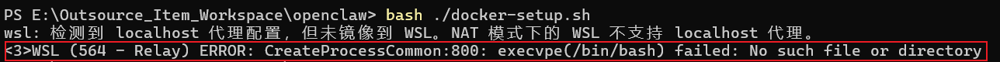
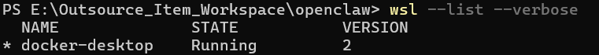
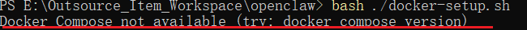
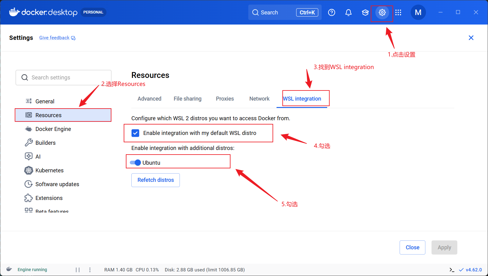
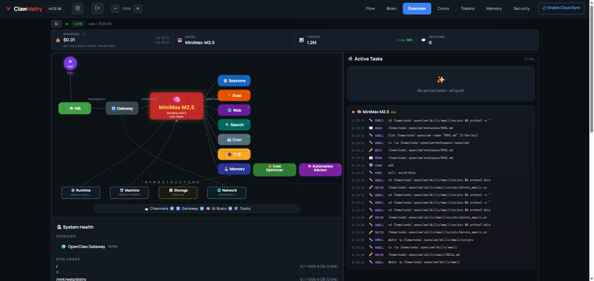

---
tags:
  - openclaw
created: 2026-04-02 18:19:00
---


# <font size=4>Windows Docker Desktop+WSL + Ubuntu + Openclaw 本地部署</font>

## <font size=3>简要概述</font>

<font size=2>

> [!info]
> OpenClaw 的核心卖点就是"能够操作电脑文件、跑命令、整理资料"，所以它设计上就是要访问文件的。但是如果让 openclaw 直接部署在宿主机，也就是使用者常用的 Windows 环境中，存在很高的安全风险，因此需要把 openclaw 部署进行隔离。

</font>

## <font size=3>部署前准备</font>

<font size=2>

> [!info]
>
> - **Docker Desktop：** 推荐启用 WSL2 后端，以获得更好性能和兼容性
> - **Git：** 用于克隆仓库
> - **Windows特定注意：** Docker Desktop 会自动处理路径映射，但 Windows 路径使用反斜杠（\），在 Docker Compose 中需转换为正斜杠（/）。如果使用 WSL2，确保 WSL2 已启用（在 PowerShell 中运行 wsl --install）
> - **权限：** 以管理员身份运行命令提示符或 PowerShell
>
> ```bash
> # 1. 查看已安装的 WSL 发行版
> wsl --list --verbose
>
> # 2. 查看可安装的发行版列表
> wsl --list --online
>
> # 3.  删除 WSL 虚拟机
> # 3.1 先关闭 WSL
> wsl --shutdown
>
> # 3.2 卸载（删除）指定发行版
> wsl --unregister Ubuntu-22.04
>
> # 4.  查看可用的 Ubuntu 版本
> wsl --list --online
>
> # 4.1 安装特定版本（例如 Ubuntu 22.04）
> wsl --install -d Ubuntu-22.04
>
> # 5. 设置Ubuntu为默认打开
> wsl --setdefault Ubuntu-22.04
>
> # 6.  更新系统并安装基础依赖
> sudo apt update && sudo apt install -y curl git wget
>
> # 7.  安装 Node.js 22（必须此版本）
> curl -fsSL https://deb.nodesource.com/setup_22.x | sudo -E bash -
> sudo apt install -y nodejs
>
> # 7.1 验证安装
> node -v    # 应显示 v22.x
> npm -v
>
> # 9. 下载openclaw源码
>
>
>
> # 进入openclaw的容器内部
> docker compose exec openclaw-gateway sh
>
> ```

</font>

### <font size=2>Step1：克隆 OpenClaw 仓库</font>

<font size=2>

1. 打开 PowerShell 或 命令提示符
2. 克隆官方仓库 & 进入仓库目录

```bash
# 1. 克隆仓库
git clone https://github.com/openclaw/openclaw

# 2. 进入仓库目录
cd openclaw

# 3. 查询可用版本

```

</font>

### <font size=2>Step2：设置 Docker 脚本</font>

<font size=2>

OpenClaw 提供了一个脚本 `docker-setup.sh` 来自动化构建和启动 Docker 环境。这会构建 gateway 镜像、运行 onboarding 向导，并通过 Docker Compose 启动服务。

1. 运行 docker-setup.sh

```bash
# 进入到openclaw文件夹
./docker-setup.sh
```

> [!warning]
> **报错： 此处运行  bash ./docker-setup.sh 会出现报错**
>
> 
>
> ```bash
> # 1. 在Powershell中执行查看默认发行版本
> wsl --list --verbose
> ```
>
> 
>
> ```text
> 分析报错原因：
> (1) docker-desktop 是 Docker Desktop 自动创建的极简 WSL 发行版（基于轻量工具链，比如 busybox 或 scratch 风格），它故意没有安装 /bin/bash（或其他完整 shell），目的是只跑 Docker 引擎的后端，不用于交互。
> (2) Windows 把这个 docker-desktop 设成了默认 WSL distro（星号 * 表示默认）
> (3) 任何时候你运行 bash、wsl（无参数）、或某些工具（如 OpenClaw/clawdock 的脚本）试图启动 bash 时，WSL relay 层就会去调用默认 distro 的 /bin/bash → 不存在 → 报错.
> ```

> [!tip]
> **解决问题方法：**
>
> ```bash
>
> # 1. 查看可安装的 Ubuntu 版本
> wsl --list --online
>
> # 2. 安装Ubuntu 22.04 LTS
> wsl --install -d Ubuntu-22.04
> # 这会从 Microsoft Store 下载并安装最新的 Ubuntu
> # 安装完后，它会自动启动一次，让你设置用户名和密码
>
> # 3. 把 Ubuntu 设置成默认
> wsl --set-default Ubuntu-22.04
>
> # 3. 启动 wsl中的 Ubuntu
> wsl -d Ubuntu-22.04
> # 4. 查看版本信息
> lsb_release -a
>
> # 5. 再次运行 ./docker_setup.sh
> ./docker_setup.sh
> ```

> [!warning]
> **Docker Compose not available 报错**
>
> 
>
> ```text
> 问题分析：
> OpenClaw 的 docker-setup.sh 脚本在检查 Docker Compose 时，用的是旧语法 docker-compose（V1 版本）。
> 但现代 Docker Desktop（4.10+ 以后，默认启用 Compose V2）用的是插件形式：命令是 docker compose（无连字符），而不是 docker-compose。
> 所以脚本检测不到旧的 docker-compose 命令 → 报错退出。
>
> 解决方案（在WSL Ubuntu 里操作）：
> setp1：先确认 Docker Desktop 已运行，且 WSL 集成已开启（Docker Desktop → Settings → Resources → WSL Integration → 勾选你的 Ubuntu）
> step2：重启 Docker Desktop
> ```
>
> 

> [!warning]
> **wsl代理网络问题**
>
> wsl: 检测到 localhost 代理配置，但未镜像到 WSL。NAT 模式下的 WSL 不支持 localhost 代理。
>
> ```text
> 原因分析:
> 由于 Windows 主机开启了本地代理（localhost 代理，比如 Clash、V2Ray、Shadowsocks 等工具设置的系统代理，通常是 127.0.0.1:1080/7890 等端口），WSL 默认用 NAT 网络模式，localhost (127.0.0.1) 在 Windows 和 WSL 之间不互通，所以 WSL 无法自动使用 Windows 的代理。
>
> 修复方式：
> 在 Windows 用户目录下创建或编辑 .wslconfig 文件，路径：C:\Users\你的用户名\.wslconfig，然后在 .wslconfig 中填写以下内容并保存
>
> [experimental]
> autoMemoryReclaim=gradual
> networkingMode=mirrored
> dnsTunneling=true
> firewall=true
> autoProxy=true
>
> 保存后，在 PowerShell（管理员）运行：
>
> wsl --shutdown
>
> 之后，再次打开wsl，或者 bash，警告就会消除
>
> ```

</font>

### <font size=2>Step3：启用官方 Sandbox 模式</font>

<font size=2>

Sandbox 模式使用 Docker 容器隔离代理工具（如 exec、read、write），防止 AI 操作影响主机。默认下，它不要求 gateway 完全在 Docker 中运行，但既然你选择 Docker 部署，它会无缝集成。

</font>


### <font size=2>Step4：挂载Windows下的盘符到openclaw</font>

<font size=2>

在 docker-compose.yml 配置文件中添加相应的需要挂载的路径
```bash
# 短语法通用格式
volumes:
  - 宿主机路径:容器内路径:权限模式
# 左边（冒号前）：宿主机（你的服务器/电脑）上的路径
# 右边（冒号后第一个）：容器内部的路径
# :rw（可选）：挂载模式（read-write = 可读可写）。如果不写，默认也是 rw。


# 在 docker-compose.yml 中在 volumes 字段下直接添加
- /mnt/k:/mnt/k:rw
- "/mnt/i/Obsidian\ note:/mnt/i/Obsidian\ note:rw"
- ~/.ssh:/home/node/.ssh:ro

```

</font>


### <font size=2>Step5：网络绑定到localhost本地网络</font>

<font size=2>

```bash
# 修改docker-compose.yml文件
# "主机IP:主机端口:容器端口"

- "127.0.0.1:${OPENCLAW_GATEWAY_PORT:-18789}:18789"
- "127.0.0.1:${OPENCLAW_BRIDGE_PORT:-18790}:18790"

# 实际效果
┌─────────────────┐         ┌─────────────────┐
│     宿主机      │  ←────  │    容器内部     │
│  127.0.0.1:18789 │ ──────→│     :18789      │  (Gateway服务)
│  127.0.0.1:18790 │ ──────→│     :18790      │  (Bridge服务)
└─────────────────┘         └─────────────────┘

```

</font>


## <font size=3>Agent状态监控的UI网页</font>

### <font size=2>ClawMetry</font>

<font size=2>

ClawMetry 是专为 OpenClaw 设计的开源实时监控面板。

```bash
# 安装
pip install clawmetry

# 檢查 clawmetry 是否真的裝好
ls ~/.local/bin/clawmetry

# 把 ~/.local/bin 加到 PATH
echo 'export PATH="$HOME/.local/bin:$PATH"' >> ~/.bashrc
source ~/.bashrc

# 启动（自动打开 localhost:8900）
clawmetry
```

</font>




## <font size=3>单openclaw，多agnet部署</font>

### <font size=2>部署新智能体</font>

<font size=2>

```bash

# 进入docker容器内部使用openclaw cli
docker exec -it openclaw-openclaw-gateway-1 bash

# 方式一：创建一个新 agent，叫 "coder-agent"
openclaw agents add coder-agent --workspace ~/.openclaw/agents/coder-agent-workspace 

# 方式二：如果想交互式创建（会问你一些问题，包括初始 identity）
openclaw agents add coder-agent

```

</font>

### <font size=2>删除子agent</font>

<font size=2>

```bash
# 先列出所有 agent 确认名称/ID（比如你新建的是 coder-agent）
openclaw agents list

# 删除指定 agent（替换成你的 agent ID/名称，例如 coder-agent）
openclaw agents delete coder-agent

# 如果想强制删除（跳过确认提示）
openclaw agents delete coder-agent --force

```

</font>

### <font size=2>查询子agent</font>

<font size=2>

```bash
# 先列出所有 agent 和它们的模型配置（带 verbose 看细节）
openclaw agents list --verbose

# 用 models 命令检查 Ollama provider 和可用模型列表
openclaw models list --local          # 只看本地模型，应该看到 ollama/ 开头的
openclaw models list --all            # 看全部，包括 Ollama 的
openclaw models status                # 快捷看当前 gateway 连接的模型状态

```

</font>


## <font size=3>打开 openclaw-control-center 面板</font>

<font size=2>

```bash
# 进入到源码所在路径
cd ~/.openclaw/workspace/tools/openclaw-data-board
npm run dev:ui

http://127.0.0.1:4320

```

</font>

## <font size=3>安装 Obsidian</font>

<font size=2>

```bash
# 1. 更新系统
sudo apt update && sudo apt upgrade -y

# 2. 安装必要依赖
sudo apt install -y libnotify4 libnss3 libsecret-1-0 libgbm1 libasound2 xdg-utils

# 3. 下载并安装最新 Obsidian（.deb 包）
wget $(curl -s https://obsidian.md/download | grep -o 'https://github.com/obsidianmd/obsidian-releases/releases/download/v[0-9.]\+/obsidian_[0-9.]\+_amd64\.deb' | head -n 1)

# 4. 安装
sudo dpkg -i obsidian_*.deb

# 5. 如果提示依赖问题，修复它
sudo apt --fix-broken install -y

# 6. 开启
obsidian

# 7. .openclaw文件对于 obsidian 隐藏，使用指令将文件夹软连接可视化路径
ln -sfn .openclaw openclaw-visible
```

</font>


## <font size=3>Ollama & API 接口调用</font>

<font size=2>

```bash 
# 1. 检查 Ollama 服务是否启动
ollama --version
ollama ps

# 2. 启动 Ollama
ollama serve &

# 3. 测试本地 API
curl http://127.0.0.1:11434/api/tags


```

</font>


