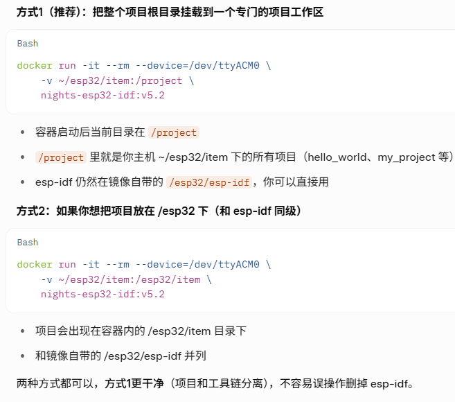

<style>
.highlight{
  color: white;
  background: linear-gradient(90deg, #ff6b6b, #4ecdc4);
  padding: 5px;
  border-radius: 5px;
}

.mint_green{
  color: white;
  background: #adcdadf2; 
  padding: 5px;
  border-radius: 5px;
}

.red {
  color: #ff0000;
}
.green {
  color:rgb(10, 162, 10);
}
.blue {
  color:rgb(17, 0, 255);
}

.wathet {
  color:rgb(0, 132, 255);
}
</style>


<font size=2>

```bash
1.安装工具链
sudo apt-get install git wget flex bison gperf python3-pip python3-venv cmake ninja-build ccache libffi-dev libssl-dev dfu-util libusb-1.0-0 net-tools

2.新建esp32文件夹
mkdir esp32

3.进入esp32文件夹安装esp-gitee-tools工具
git clone https://gitee.com/EspressifSystems/esp-gitee-tools.git

4.执行gitee工具切换镜像脚本
cd esp-gitee-tools
./jihu-mirror.sh set

5.进入esp32文件夹并安装esp-idf工具
git clone --recursive https://github.com/espressif/esp-idf.git

6.进入esp-idf文件夹并切换ESP32的版本为v5.2版本
git checkout v5.2
git submodule update --init --recursive

7.更换pip源
pip config set global.index-url http://mirrors.aliyun.com/pypi/simple
pip config set global.trusted-host mirrors.aliyun.com

8.安装编译工具
../esp-gitee-tools/install.sh

9.配置esp-idf环境
【方法一】
ESP32环境配置idf.py的环境变量配置方法（永久有效）
1.切换在根目录下，输入ls -al
2.可以看到有一个.profile文件
3.输入vim .profile使用vim对该文件进行编译
4.在文中中插入 source esp32/esp-idf/export.sh
	
【方法二】
ESP32环境配置idf.py的环境变量配置方法（永久有效）						
1.在根目录下输入   echo $SHELL	 查询命令行语言
2.输入   nano ~/.bashrc	打开文件
3.将 alias get_idf='. $HOME/esp32/esp-idf/export.sh' 加入到文件中
4.每次进入时需要idf.py时，输入  get-idf   就可以配置环境了
```

</font>


---

## <font size=3>创建ESP32开发环境的Docker镜像</font>
<font size=2>

### 1. Dockerfile 的编写

<span class="red">遇到的问题：</span>当步骤5-6中最后不加 --force 时，docker build 会构建失败，原因是使用的 jihu-mirror 镜像站中的子模块内容与 github 中的版本不一致导致的
<span class="red">解决的方法：</span>在整个 submodule update 前加 --force


```bash

FROM ubuntu:24.04

# 避免交互式提示
ENV DEBIAN_FRONTEND=noninteractive

# Install dependencies
RUN apt-get update && apt-get install -y \
    sudo \
    git wget flex bison gperf \
    python3 python3-pip python3-venv \
    cmake ninja-build ccache \
    libffi-dev libssl-dev dfu-util libusb-1.0-0 net-tools \
    && rm -rf /var/lib/apt/lists/*

# 关键修复：删除预装的 ubuntu 用户和组（释放 1000:1000）
RUN userdel -r ubuntu || true

# 创建与主机匹配的普通用户（假设主机 uid/gid=1000，你可以改成你的实际 id -u / id -g）
ARG USERNAME=espuser
ARG USER_UID=1000
ARG USER_GID=$USER_UID

RUN groupadd --gid $USER_GID $USERNAME \
    && useradd --uid $USER_UID --gid $USER_GID -m $USERNAME \
    # 给 sudo 无密码权限（开发最方便）
    && echo $USERNAME ALL=\(root\) NOPASSWD:ALL > /etc/sudoers.d/$USERNAME \
    && chmod 0440 /etc/sudoers.d/$USERNAME

# 创建工作目录（这个工作目录是在容器内部的）
WORKDIR /esp32

# 步骤3-4: 克隆 esp-gitee-tools 并切换极狐镜像
RUN git clone https://gitee.com/EspressifSystems/esp-gitee-tools.git \
    && cd esp-gitee-tools \
    && ./jihu-mirror.sh set

# 步骤5-6: 克隆 ESP-IDF v5.2（使用 --recursive）
RUN git clone --recursive https://github.com/espressif/esp-idf.git \
    && cd esp-idf \
    && git checkout v5.2 \
    && git submodule update --init --recursive --force

# 步骤7: 更换 pip 为阿里云源
RUN pip config set global.index-url http://mirrors.aliyun.com/pypi/simple \
    && pip config set global.trusted-host mirrors.aliyun.com

ENV IDF_GITHUB_ASSETS="dl.espressif.cn/github_assets"

# 步骤8: 安装 ESP-IDF 工具链（只针对 esp32，加速下载）
RUN cd esp-idf && ./install.sh esp32  

# 自动激活环境 + 欢迎消息（对普通用户）
RUN echo ". /esp32/esp-idf/export.sh" >> /home/$USERNAME/.bashrc \
    && echo "echo 'ESP-IDF v5.2 environment auto-activated!'" >> /home/$USERNAME/.bashrc \
    && echo "echo 'Use sudo if you need to install extra packages.'" >> /home/$USERNAME/.bashrc

# 切换到普通用户（运行时默认）
USER $USERNAME

# 默认进入交互式 shell
CMD ["/bin/bash"]

```

### 2. images的构建 
Docker 构建镜像时，需要知道 Dockerfile 在哪里，以及 构建上下文（context） 是什么目录。  

```bash
# 正确的用法
docker build [选项] -t 镜像名:标签  路径
# 其中的 路径 必须明确指定，通常是：
#  . 表示当前目录（最常用）
#  或者具体路径，如 /home/user/esp32/docker
```
现在在 ~/esp32/docker 目录下，正确执行：

```bash
docker build -t nights-esp32-idf:v5.2 .
```

### 3. esp32-docker的使用

在构建容器镜像时，在 Dickerfile 中设置了 esp32 工作空间，这里说明一下。

| 概念             | 位置        | 作用                                                                                       |
| ---------------- | ----------- | ------------------------------------------------------------------------------------------ |
| `WORKDIR /esp32` | 容器内部    | Dockerfile 中设置的“当前工作目录”仅影响构建阶段的路径（比如 git clone 会克隆到 /esp32 下） |
| 挂载卷 -v        | 主机 ↔ 容器 | 运行容器时手动建立的“文件同步通道”                                                         |


关于`WORKDIR /esp32`:
- 这只是在构建镜像时，把后续所有命令的当前目录设置为容器内的 /esp32
- 结果：esp-idf、esp-gitee-tools 等都被安装到了容器镜像里的 /esp32/esp-idf 这个路径
- 这个 /esp32 是镜像自带的内容，每次新启动容器时都会原样出现（除非被挂载覆盖）

关于运行容器的命令：
`docker run -it --rm --user $(id -u):$(id -g) --device=/dev/ttyACM0 -v ~/esp32/item/:/esp32/item/ nights-esp32-idf:v5.2`

这里只挂了一个子路径：
- 主机路径： `~/esp32/item/`
- 容器路径： `/esp32/item/`

效果是：
- 容器内的 `/esp32/item/` 目录内容会和主机 `~/esp32/item/` 完全同步（双向实时）
- 但容器内的其他路径（如 /esp32/esp-idf、/esp32/esp-gitee-tools）仍然是镜像自带的，不会映射到主机




**<span class="blue">准备主机上的项目目录</span>**

```bash
# 创建的这个目录下的所有内容都会同步到容器里，容器退出后代码也不会丢失
mkdir -p ~/esp32/item
cd ~/esp32/item
```
---

**<span class="blue">按如下配置产生的VScode远程修改文件权限无法写入问题解决方法</span>**

```bash
# 容器采用root级别开启
docker run -it --rm --device=/dev/ttyACM0 -v ~/esp32/item:/esp32/item nights-esp32-idf:v5.2
```
**问题：** 在容器中创建了挂载卷后，主机中的与之对应的文件就可以同时被编辑篡改，但是在VScode上的ssh的文件，无法通过修改来达到修改容器文件内容的目的。
**核心原因：** 在 VS Code Remote-SSH 里打开了容器挂载的项目文件夹，但容器内的文件权限导致 VS Code（运行在主机上的进程）无法写入主机上的 sdkconfig 文件。
**为什么会出现权限问题：**
1. Docker 容器默认以 root 用户（uid=0）运行
2. 容器内运行 `idf.py menuconfig` → `生成/修改 sdkconfig` 时，用的是 root 用户写入
3. 挂载卷 `-v ~/esp32/item/hello_world:/esp32/item/hello_world` 把容器内的文件映射回主机时，文件所有者变成了 root（或高 uid）
4. 主机上的你（nights 用户，uid 通常是 1000）没有写权限 → VS Code 保存失败

**解决方法：让容器以你的用户身份运行**

修改启动容器的命令，加上 --user 参数，让容器内进程使用你主机的 uid/gid：
先在主机查你的 uid/gid：
```bash
id -u   # 通常是 1000
id -g   # 通常是 1000
```
查主机 dialout 的 GID（你已经知道，通常是 20）
```bash
getent group dialout   # 确认是 dialout:x:20:nights
```
然后启动容器时这样写：
```bash

docker run -it --rm --user $(id -u):$(id -g) --group-add 20 --device=/dev/ttyACM0 -v ~/esp32/item/:/esp32/item/ nights-esp32-idf:v5.2

#或

docker run -it --rm \
    --user $(id -u):$(id -g) \                  # 使用当前主机用户的 UID:GID，避免文件权限问题（VS Code 保存、主机编辑无障碍）
    --group-add 20 \                            # 20 是 dialout 的 GID，根据输出改
    --device=/dev/ttyACM0 \                     # 传递 ESP32 串口设备（根据实际设备调整，如 /dev/ttyUSB0、/dev/ttyACM1）
    -v ~/esp32/item:/esp32/item \               # 挂载主机项目目录到容器内（双向同步，代码修改实时保存到主机）
    nights-esp32-idf:v5.2                       # 你的自定义 ESP-IDF v5.2 镜像

```
这样容器内运行的 idf.py、menuconfig 等都会用你的 uid 创建/修改文件，主机上文件所有者就是 nights 用户，VS Code 就能正常读写

---

**<span class="blue">启动容器进入开发环境</span>**

```bash
# 启动 ESP32 开发容器（推荐命令）
docker run -it --rm \
    --user $(id -u):$(id -g) \
    --group-add 20 \
    --device=/dev/ttyACM0 \
    -v ~/esp32/item/:/esp32/item/ \
    nights-esp32-idf:v5.2

# 合成一行就是
docker run -it --rm --user $(id -u):$(id -g) --group-add 20 --device=/dev/ttyACM0 -v ~/esp32/item:/esp32/item nights-esp32-idf:v5.2

# 参数详细说明：
# -it                       交互式终端 + 分配伪终端（必须有，否则无法正常输入命令/看到输出）
# --rm                      容器退出后自动删除（保持主机干净，不留临时容器）
# --user $(id -u):$(id -g)  让容器内进程使用主机用户的权限（非常重要！防止 sdkconfig 等文件变成 root 拥有，导致主机无法保存）
# --device=...              必须传递串口，否则无法 flash/monitor（用 ls /dev/tty* 查看实际设备名，通常为 ttyACM0 或 ttyUSB0）
# -v 主机路径:容器路径        实现主机与容器文件共享（项目代码、sdkconfig、build 目录等都会同步）

# 常见调整示例：
# 如果串口是 ttyUSB1：   --device=/dev/ttyUSB1
# 如果想挂载整个 item 目录下的子项目：  -v ~/esp32/item:/project （推荐，容器内直接 cd /project）
# 如果需要 root 权限操作（临时）：去掉 --user 参数
```


**<span class="blue">在容器内编译、烧录、监控</span>**

```bash
# 进入你的项目（以 hello_world 为例）
cd hello_world

# 配置（第一次建议做一次）
idf.py menuconfig

# 编译
idf.py build

# 烧录（确保开发板已连接）
idf.py -p /dev/ttyACM0 flash

# 监控串口输出（查看打印信息）
idf.py -p /dev/ttyACM0 monitor
# 监控时用 Ctrl + ] 退出（注意不是 Ctrl+C）
```

</font>


## <font size=3>上传ESP32的Docker镜像到DockerHub</font>

<font size=2>

### <font size=2>1. 登录Docker Hub </font>

- 打开浏览器访问 https://hub.docker.com/
- 如果没有账号，点击 Sign Up 注册（用邮箱或 GitHub 登录）
- 注册/登录后，记下你的 Docker ID（通常是你注册的用户名）

### <font size=2>2. 在 Docker Hub 创建仓库 </font>

- 登录后，点击右上角 Create Repository（或左侧菜单 Repositories → Create）
- epository name：填一个名字，例如 esp32-image（建议用小写、连字符）
- Visibility：选 Public（免费无限公开仓库）或 Private（免费有数量限制）
- 点击 Create 创建仓库
- 创建后，页面会显示类似提示命令：
```bash
docker tag <local-image> <your-username>/esp32-image:latest
docker push <your-username>/esp32-image:latest
```

### <font size=2>3. 在本地登录 Docker Hub (Ubuntu主机执行) </font>

```bash
docker login

# 输入你的 Docker ID（用户名）和 密码（或个人访问令牌，如果启用了 2FA）
# 成功后显示：Login Succeeded

```

### <font size=2>4. 为镜像打标签（Tag） </font>

假设本地镜像是 nights-esp32-idf:v5.2，需要改成 Docker Hub 格式：`<你的用户名>/<仓库名>:<标签>`

```bash
# 示例：假设你的 Docker ID 是 nights，仓库名是 esp32-idf-dev
docker tag nights-esp32-idf:v5.2 nights/esp32-idf-dev:v5.2

# 同时打一个 latest 标签（可选，但常用）
docker tag nights-esp32-idf:v5.2 nights/esp32-idf-dev:latest
```
验证：运行 `docker images`，你会看到新标签的镜像:

```text
REPOSITORY                  TAG       IMAGE ID       CREATED        SIZE
nights/esp32-idf-dev        v5.2      abc123def      5 minutes ago  1.2GB
nights-esp32-idf            v5.2      abc123def      10 minutes ago 1.2GB
```

### <font size=2>5. 上传镜像（Push） </font>

```bash
# 推送特定版本
docker push nights/esp32-idf-dev:v5.2

# 同时推送 latest（如果打了）
docker push nights/esp32-idf-dev:latest
```

- 推送过程会显示进度条（可能几分钟到十几分钟，取决于镜像大小和网络）
- 成功后显示类似：`latest: digest: sha256:abc... size: 1234`


### <font size=2>6. 验证上传</font>

回到浏览器 Docker Hub 页面，刷新仓库，如果看到Tags列表中有V5.2就代表成功了。


</font>

