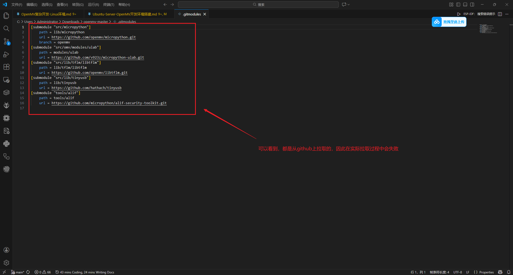
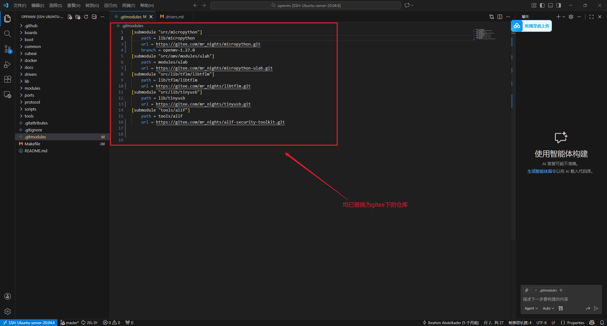
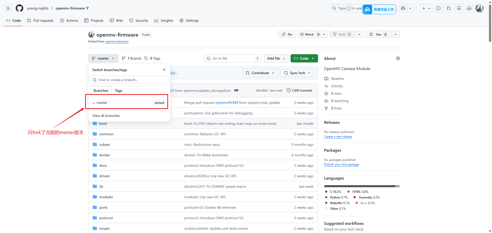
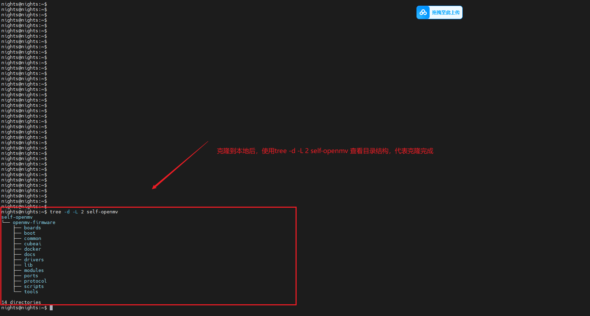

<style>
.highlight{
  color: white;
  background: linear-gradient(90deg, #ff6b6b, #4ecdc4);
  padding: 5px;
  border-radius: 5px;
}

.mint_green{
  color: white;
  background: #adcdadf2; 
  padding: 5px;
  border-radius: 5px;
}

.red {
  color: #ff0000;
}
.green {
  color:rgb(10, 162, 10);
}
.blue {
  color:rgb(17, 0, 255);
}

.wathet {
  color:rgb(0, 132, 255);
}
</style>


# <span class="wathet"><font size=4>OpenMV-Linux环境配置</font></span>
## <font size=3>一、Docker Build</font>
<font size=2>

- <span class="blue">安装Docker在Ubuntu上运行</span>
  
```bash
sudo apt update
sudo apt install -y docker.io
sudo usermod -aG docker $USER  # 添加当前用户到 docker 组，重启终端生效
```

- <span class="blue">使用官方 Docker 构建固件</span>

 **1. 克隆 OpenMV 仓库（使用浅克隆加速）**

```bash
git clone --depth=50 git@github.com:openmv/openmv.git
cd openmv
```


**2. 配置Docker的镜像源**


<div style="background:#bff3f0;padding:10px;border-radius:6px;color:#333;">
在中国网络环境下：Docker Hub 的服务器在美国，受网络限制（GFW）影响，直接访问经常超时、连接失败或速度极慢。
</div>

在中国，最可靠的办法是配置 Docker 的 registry-mirrors，让 Docker 自动从国内镜像站拉取镜像。

```bash
# 1. 创建并编辑 Docker 配置文件
sudo mkdir -p /etc/docker
sudo nano /etc/docker/daemon.json

# 2. 粘贴复制以下内容到daemon.json文件中
{
  "registry-mirrors": [
    "https://docker.m.daocloud.io",
    "https://docker.1panel.live",
    "https://hub.rat.dev",
    "https://docker-cf.registry.cyou",
    "https://docker-0.unsee.tech",
    "https://hub.rat.dev",
    "https://dockerproxy.net",
    "https://docker.xuanyuan.me"
  ]
}

# 3. 保存退出（Ctrl+O → Enter → Ctrl+X），然后重启 Docker 服务
sudo systemctl daemon-reload
sudo systemctl restart docker
```

**3. 修改配置文件**

<div style="background:#bff3f0;padding:10px;border-radius:6px;color:#333;">
虽然步骤2对Docker的镜像站进行了配置，但是实际操作过程中，在拉去OpenMV的子模块代码时，依旧出现了网络问题导致的无法拉取成功的情况。因此，修改 openmv 文件中的 .gitmodules 文件，修改拉取的地址。
</div>

- <span class="blue">原本的.gitmodules文件内容</span>



- <span class="blue">把.gitmodules中的要拉取的仓库镜像到gitee上</span>
```bash
步骤 1️⃣：登录 Gitee
打开 https://gitee.com，登录你的账号

步骤 2️⃣：新建仓库 → 选择“导入仓库”
  1.点击右上角 ➕ 新建仓库
  2.选择 “从 GitHub / GitLab 导入”

步骤 3️⃣：填写 GitHub 仓库地址

步骤 4️⃣：创建
```

- <span class="blue">修改后的.gitmodules文件内容</span>



```bash
[submodule "src/micropython"]
	path = lib/micropython
	url = https://github.com/openmv/micropython.git
	branch = openmv
[submodule "src/omv/modules/ulab"]
	path = modules/ulab
	url = https://github.com/v923z/micropython-ulab.git
[submodule "src/lib/tflm/libtflm"]
	path = lib/tflm/libtflm
	url = https://github.com/openmv/libtflm.git
[submodule "src/lib/tinyusb"]
	path = lib/tinyusb
	url = https://github.com/hathach/tinyusb
[submodule "tools/alif"]
	path = tools/alif
	url = https://github.com/micropython/alif-security-toolkit.git
```


**4. 进入 Docker 目录并构建**

<spam class="red">这里要使用docker内部构建的编译器，就必须使用进入到docker文件夹中的make进行构建</span>

- OpenMV 项目专门在 docker/ 目录下提供了一个包装用的 Makefile（就是那个 make 文件，没有后缀）
- 这个 Makefile 的作用是：
  (1) 自动拉起（或进入）一个预配置好的 Docker 容器
  (2) 把整个 openmv 仓库挂载到容器内部
  (3) 在容器里执行真正的编译命令（使用 ARM 工具链、MicroPython 端口等）
- 如果调用仓库其他目录下的普通 make（比如根目录的 Makefile），它会尝试在宿主机本地直接编译，而不是在 Docker 容器里运行。这会导致：
  (1) 缺少 ARM GCC 工具链、依赖库等，报错一大堆;
  (2) 即使手动安装了工具链，也很容易因为环境不一致而出错;


<spam class="red">必须在 OpenMV 仓库的 boards/ 文件夹中修改自定义板子配置（只能在源文件的基础上修改），才能使用 Docker 构建方式（make TARGET= 板型）来编译固件</span>

- OpenMV 的构建系统（Makefile 和 ports/stm32 的配置）会自动扫描根目录下的 boards/ 文件夹，寻找子文件夹作为支持的板型（TARGET）;
- 每个官方板型（如 OPENMV4、OPENMV4P、OPENMV_N6 等）都是 boards/ 下的一个独立子文件夹，里面包含：
  (1) mpconfigboard.h（板级 MicroPython 配置）;
  (2) mpconfigboard. mk（构建选项，如引脚定义、闪存布局等）;
  (3) omv_boardconfig.h（OpenMV 特定硬件配置，如传感器引脚、LED、存储等）;
  (4) 有时还有其他文件如 README 或特定脚本;

```bash
cd ~/openmv/docker
# 先构建镜像
docker build -t openmv-builder:latest -f Dockerfile .
# 如果已经构建就启动镜像(这一步可忽略)
docker run --rm -it openmv-builder:latest bash
# make TARGET=<你的板型>
make TARGET=OPENMV4 #针对H7
```


<div style="background:#e8f5e8;padding:10px;border-radius:6px;color:#333;">
ℹ️ TARGET 参数：指定你的 OpenMV 相机型号。常见选项（查看仓库 src/omv/boards/ 目录确认最新）：<br>
✅ 官方 OpenMV 系列（STM32）

| BSP名称     | 对应板子           | MCU              |
| ----------- | ------------------ | ---------------- |
| OPENMV2     | OpenMV Cam M4      | STM32F427        |
| OPENMV3     | OpenMV Cam M7      | STM32F767        |
| OPENMV4     | OpenMV Cam M7 Plus | STM32F769        |
| OPENMV4_H7  | OpenMV Cam H7      | STM32H743 / H750 |
| OPENMV4P    | OpenMV Cam M7 Pro  | STM32F769        |
| OPENMV_NANO | OpenMV Nano        | STM32F411        |

✅ OpenMV RT 系列（NXP）

| BSP名称       | 对应板子      | MCU             |
| ------------- | ------------- | --------------- |
| OPENMV_RT     | OpenMV RT1060 | NXP i.MX RT1062 |
| OPENMV_RT1020 | OpenMV RT1020 | NXP i.MX RT1020 |

</div>
</font>


---


## <font size=3>二、构建自己的docker容器</font>
<font size=2>
<div style="background:#e8f5e8;padding:10px;border-radius:6px;color:#333;">
在配置自己的OpenMV的开发环境之前，对于Ubuntu-Server-20.04.6版本需要先进行一些准备配置：

1. 参考[Ubuntu-Server-网络代理配置](https://github.com/young-nights/some-tutorials/blob/main/1.8-Linux%E6%B6%89%E5%8F%8A%E5%88%B0%E7%9A%84%E4%B8%80%E4%BA%9B%E7%AC%94%E8%AE%B0/Ubuntu-Server-%E7%BD%91%E7%BB%9C%E4%BB%A3%E7%90%86%E9%85%8D%E7%BD%AE.md),先把Ubuntu-Server的VPN网络配置好，方便从Github等墙外网站拉取代码；

2. 参考上文中对于docker镜像源的配置，把镜像网站地址的配置文件编辑好，对代码拉取进行一个兜底；

3. 在自己的Github仓库中Fork官方的OpenMV的源码，稍后配置时需要用到；

</div>

### - <span class="blue"><font size=2>准备工作<font></span>

**1. Fork官方的openmv源码到自己的Github仓库**



**<span class="green">注意：克隆下来的源码中有一些子模块是没有被一起跟着克隆到本地的，因此需要在.gitmodules中进行配置拉取</span>**


**2. 在Ubuntu-Server-20.04.6的环境中拉取fork的源码**


**<span class="green">注意：必须使用git clone ssh进行克隆，使用HTTP下载到本地不存在.git文件，这样后面的.gitmodules无法正常拉取子模块</span>**
```bash
# 这里按需改成自己的仓库地址
git clone git@github.com:young-nights/openmv-firmware.git

# tree 查看克隆的目录
tree -d -L 2 self-openmv
```



### - <span class="blue"><font size=2>代码裁剪<font></span>

<div style="background:#e9d5ff;padding:10px;border-radius:6px;color:#333;">


</div>


### - <span class="blue"><font size=2>自定义板子代码移植<font></span>

<div style="background:#e9d5ff;padding:10px;border-radius:6px;color:#333;">


</div>


</font>