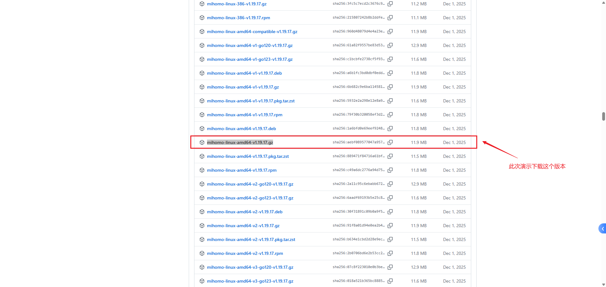

<style>
.highlight{
  color: white;
  background: linear-gradient(90deg, #ff6b6b, #4ecdc4);
  padding: 5px;
  border-radius: 5px;
}

.mint_green{
  color: white;
  background: #adcdadf2; 
  padding: 5px;
  border-radius: 5px;
}

.red {
  color: #ff0000;
}
.green {
  color:rgb(10, 162, 10);
}
.blue {
  color:rgb(17, 0, 255);
}

.wathet {
  color:rgb(0, 132, 255);
}
</style>


## <span class="wathet"><font size=3>Ubuntu-Server-网络代理配置</font></span>
### <font size=2>一、下载Clash.Meta核心文件</font>

[Github下载地址](https://github.com/MetaCubeX/mihomo/releases?referrer=grok.com)
```bash
通过网盘分享的文件：mihomo-linux-amd64-v1.19.17.gz
链接: https://pan.baidu.com/s/17c-JELUVzxFZvzAA5zjKbA?pwd=4j7s 提取码: 4j7s 
--来自百度网盘超级会员v9的分享
```

选择一个最新版本的压缩包进行下载，然后通过 FileZilla 传输到 Ubuntu 中。

```bash
# 创建一个文件夹用于存放 mihomo 文件
mkdir -p ~/mihomo
```




解压并赋予执行权限

```bash
# 解压（会得到 mihomo 可执行文件）
gunzip mihomo-linux-amd64-v1.19.17.gz

# 重命名（推荐，便于后续使用）
mv mihomo-linux-amd64-v1.19.17 mihomo

# 赋予执行权限
chmod +x mihomo
```
**购买的URL链接的本质是什么？**
<div style="background:#e8f5e8;padding:10px;border-radius:6px;color:#333;">
订阅的URL链接本质上是一个机场提供的节点列表，他返回的内容通常是：

- 一串 base64 编码 的字符串（最常见），解码后是一行行代理链接（如 ss://、vmess://、trojan:// 等）
- 或者直接是 YAML 格式的 proxies 列表（少数机场）
- 极少数直接返回完整 config.yaml 

</div>

<br><br>

---

**为什么 Mihomo（Clash Meta 核心）不能直接用这个 URL 启动，而需要一个 .yaml 配置文件？**

<div style="background:#bff3f0;padding:10px;border-radius:6px;color:#333;">

**核心原理：Mihomo 是一个“规则路由引擎”，不是单纯的节点连接器**

Mihomo 的完整功能远不止“连上几个节点”，它是一个高度可定制的流量分流系统。启动 Mihomo 时，它必须读取一个完整的配置文件（默认 config.yaml），这个文件告诉它：
1. 监听哪些端口（mixed-port: 7890 用于 HTTP/SOCKS 代理）
2. 开启哪些功能（TUN 模式、全局代理、DNS 劫持、嗅探、外部控制器 API 等）
3. 如何处理 DNS（防污染、fake-ip、nameserver 等）
4. 流量怎么分流（rules 部分：DOMAIN-SUFFIX、GEOIP、IP-CIDR、PROCESS-NAME 等规则决定走代理、直连还是拒绝）
5. 节点怎么分组 & 自动选择（proxy-groups：url-test 测速自动选、fallback 故障转移、select 手动选等）
6. 外部资源怎么加载（proxy-providers、rule-providers：订阅链接、规则集）

订阅 URL 只提供了第 6 点的一部分：一堆代理节点（proxies）。它缺少上面 1~5 的所有配置。如果直接把订阅内容喂给 Mihomo，它不知道怎么监听端口、怎么分流、怎么选节点，最终就启动不了或功能残缺。

</div>

<br><br>

---


**Mihomo 如何处理订阅 URL（proxy-providers 机制）**

1. 配置 config.yaml 文件

```bash
# 基本设置
mixed-port: 7892               # HTTP/SOCKS 混合代理端口（系统/Docker 可设置这个代理）
allow-lan: false               # 不允许局域网访问（如果服务器有其他设备连）
mode: rule                     # 规则模式（支持分流）
log-level: info                # 日志级别（debug 更详细，silent 最安静）
external-controller: 0.0.0.0:9090  # REST API 端口，用于 dashboard 或外部控制
secret: ""                     # API 密码（空=无密码，生产环境建议设强密码）

# 动态订阅提供者（自动拉取和更新节点列表）
proxy-providers:
  my-sub:                      # 提供者名称（随便起）
    type: http                 # 从 HTTP/HTTPS 下载订阅
    url: "https://drfytjmjhggnrgergergergerg6555.saojc.xyz/api/v1/client/subscribe?token=14ae31d3e79e19f33a90d000c010773c"  # 你的订阅 URL
    path: ./proxies/my-sub.yaml  # 缓存路径（自动创建）
    interval: 3600             # 每 1 小时自动更新订阅（秒）
    health-check:              # 健康检查（测试节点可用性）
      enable: true
      url: "https://www.gstatic.com/generate_204"  # 测试 URL（可换成 http://cp.cloudflare.com/generate_204 如果墙高）
      interval: 300            # 每 5 分钟检查一次（秒）
      lazy: true               # 延迟加载（只在用时检查）
      timeout: 5               # 超时秒数

# 节点分组（核心：自动选择组）
proxy-groups:
  - name: "AUTO"               # 自动选择组
    type: url-test             # 类型：URL 测试（自动测延迟选最优节点）
    use:                       # 使用哪些提供者的节点
      - my-sub
    url: "http://www.gstatic.com/generate_204"  # 测试 URL（同上）
    interval: 300              # 每 5 分钟重新测试一次（秒）
    tolerance: 50              # 容忍延迟差（ms），低于这个差值不切换
    lazy: true                 # 延迟评估（只在需要时测试）

  - name: "Fallback"           # 备用组（可选，手动或 fallback 切换）
    type: fallback             # 类型：故障转移（如果 AUTO 节点全挂，自动切下一个）
    proxies:                   # 包含的代理
      - AUTO                   # 先用自动组
      - DIRECT                 # 回退到直连

# 规则（流量分流：默认走 AUTO 自动组）
rules:
  - DOMAIN-SUFFIX,google.com,AUTO  # 示例：Google 域名走自动节点
  - GEOIP,CN,DIRECT                # 示例：中国 IP 直连（防国内流量走代理）
  - MATCH,AUTO                     # 所有其他流量默认走 AUTO（自动选节点）

# TUN 模式（可选：全局代理所有流量，无需手动设代理）
#tun:
#  enable: true                   # 启用 TUN（需 root 或 cap 权限）
#  stack: system                  # 系统栈（gvisor 更兼容但慢）
#  auto-route: true               # 自动设置路由表
#  auto-detect-interface: true    # 自动检测网络接口
#  dns-hijack:                    # 劫持 DNS 防止泄漏
#    - any:53

# DNS 设置（防污染，必需）
dns:
  enable: true                   # 启用 DNS 服务器
#  listen: 0.0.0.0:53             # 监听端口（系统 DNS 可设为 127.0.0.1）
  enhanced-mode: fake-ip         # 假 IP 模式（防泄漏）
  fake-ip-range: 198.18.0.1/16   # 假 IP 池
  nameserver:                    # 上游 DNS
    - 8.8.8.8                    # Google
    - 1.1.1.1                    # Cloudflare
    - https://dns.google/dns-query  # DoH（加密）
  fallback:                      # 备用 DNS（如果主失败）
    - tls://1.1.1.1
```


1. 测试运行

```bash
# 前台，看日志
./mihomo -d . -f config.yaml
# 看日志：应看到 "Start initial compatible provider my-sub"，然后拉取订阅、测试节点；
# 如果有 WARN（如 subscription-userinfo），忽略（不影响）；
# Ctrl+C 停止；

```

3. 后台运行&开机自启

```bash
# 控制台输入指令
sudo nano /etc/systemd/system/mihomo.service

# 编辑内容
[Unit]
Description=Mihomo Proxy Service
After=network.target

[Service]
Type=simple
ExecStart=/home/nights/mihomo/mihomo -d /home/nights/mihomo -f config.yaml
Restart=always
RestartSec=5
# User=nights            
WorkingDirectory=/home/nights/mihomo
LimitNOFILE=65535

[Install]
WantedBy=multi-user.target

# 保存后，在控制台依次输入
sudo systemctl daemon-reload
sudo systemctl enable mihomo
sudo systemctl start mihomo
sudo systemctl status mihomo   # 检查状态
journalctl -u mihomo -e -f     # 实时日志
```

4. 测试功能
<font size = 2>

- <span class="blue">检查外部 IP（走代理）</span>
```bash
curl ifconfig.me             # 应显示节点 IP（非本地）
```

- <span class="blue">测试 SOCKS/HTTP 代理</span>

```bash
curl -x socks5h://127.0.0.1:7892 https://ifconfig.me
curl -x http://127.0.0.1:7892 https://ifconfig.me
curl -v -4 https://registry-1.docker.io/v2/
curl -v -4 https://www.google.com
```

- <span class="blue">查看节点列表和当前选的节点（用 API）</span>
```bash
curl http://127.0.0.1:9090/proxies
```

<font>