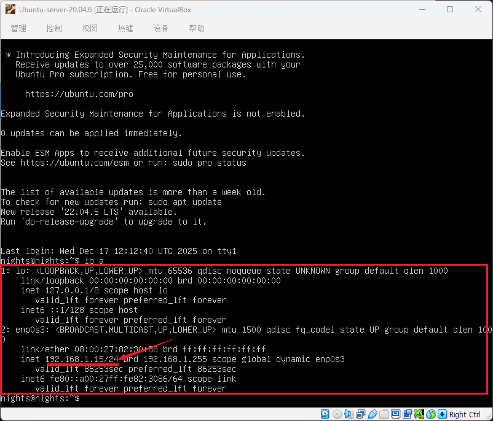
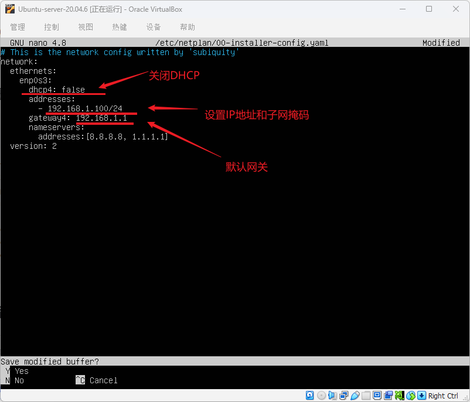
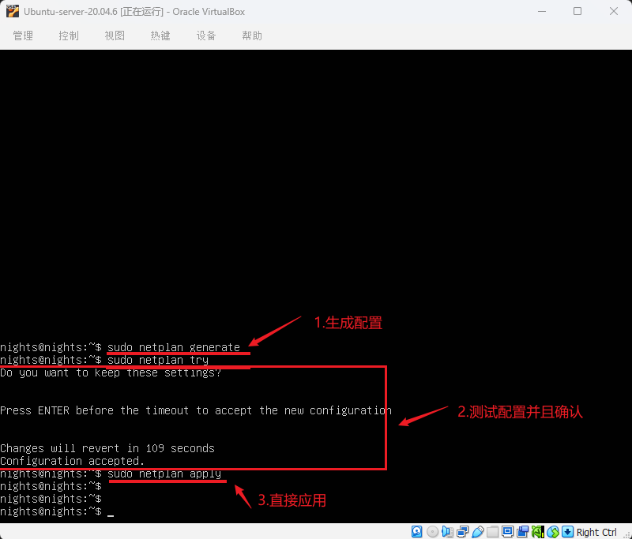
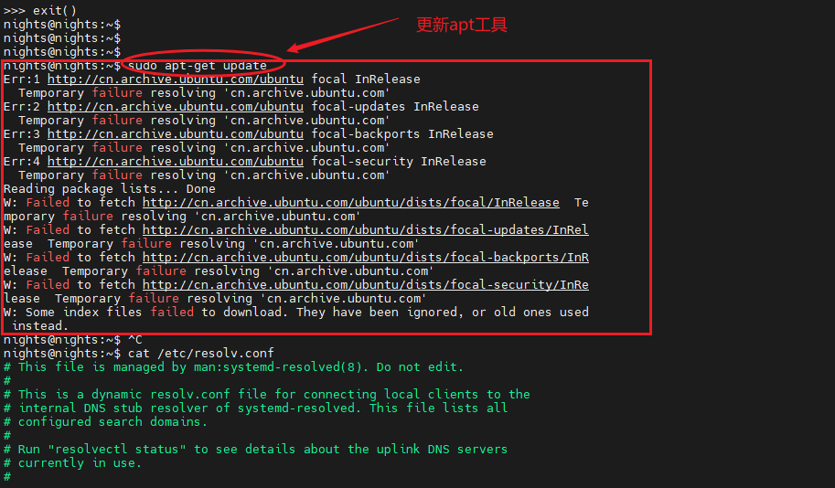
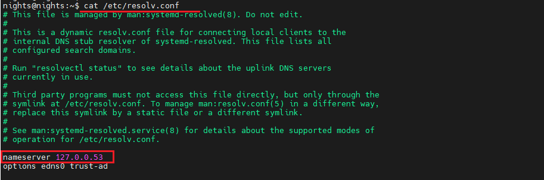
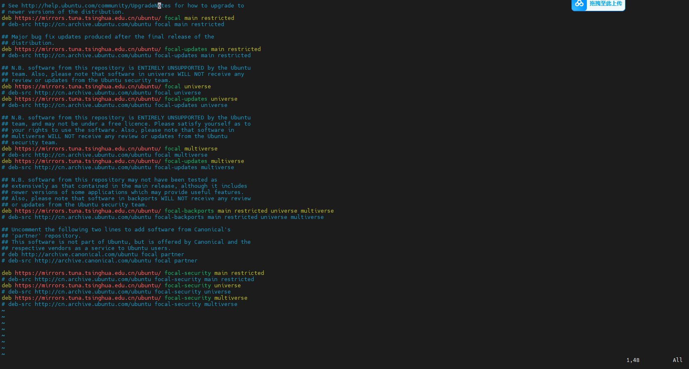

# <font size=4>Ubuntu初始软件配置与安装</font>

## <font size=3>一、软件安装 & 环境配置</font>

<font size=2>

[Ubuntu-Server-ESP32开发环境搭建](./Ubuntu-Server-ESP32开发环境搭建.md)
[Ubuntu-Server-Git环境搭建](./Ubuntu-Server-Git环境搭建.md)
[Ubuntu-Server-OpenMV-Docker配置步骤](./Ubuntu-Server-OpenMV开发环境搭建.md)
[Ubuntu-Server-网络代理配置](./Ubuntu-Server-网络代理配置.md)

---

</font>

## <font size=3>二、网络设置</font>

<font size=2>

> [!info]
> ℹ️ 为了方便在 Windows 系统种使用 MobaXTerm 对 Linux-server 进行运维管理，需要设置一下 Ubuntu的静态IP地址，以方便每次进行远程连接。

</font>

### <font size=2>使用Netplan进行IP地址设置</font>

<font size=2>

```bash

# <font size=4>确定网络接口名称</font>

ip a
```


```bash

# <font size=4>备份原配置</font>

sudo cp /etc/netplan/00-installer-config.yaml /etc/netplan/00-installer-config.yaml.backup

# <font size=4>编辑配置文件</font>

sudo nano /etc/netplan/00-installer-config.yaml
```


```bash

# <font size=4>生成配置</font>

sudo netplan generate  

# <font size=4>测试配置（按Enter确认）</font>

sudo netplan try       

# <font size=4>或直接应用</font>

sudo netplan apply
```


```bash

# <font size=4>查看IP地址</font>

ip a

# <font size=4>测试网络连接</font>

ping -c 4 8.8.8.8

# <font size=4>查看路由</font>

ip route show
```

</font>

### <font size=2>DNS配置</font>

<font size=2>

> [!info]
> ℹ️ 在更新以及下载工具链时， Ubuntu 系统无法解析域名，导致更新失败。



1. 绕过 DNS 直接测试网络系统的连通性

```bash

# <font size=4>测试 IP 连通性</font>

ping -c 4 8.8.8.8

# <font size=4>如果能通，说明网络没问题，问题在 DNS</font>

# <font size=4>如果超时，说明网络本身未连接（检查网线/Wi-Fi、路由器）</font>

```

2. 查看系统使用的 DNS 服务器

```bash
cat /etc/resolv.conf
```


```bash
resolvectl status
```
你会看到类似输出，注意 Current DNS Server 是否为空或不可用：
```bash
Global
         Protocols: -LLMNR -mDNS -DNSOverTLS DNSSEC=no/unsupported
  resolv.conf mode: stub

Link 2 (eth0)
    Current Scopes: DNS
Current DNS Server:  # <- 这里可能是空的！

       DNS Servers: 
```

3.修改 DNS 配置

```bash

# <font size=4>编辑配置文件</font>

sudo nano /etc/systemd/resolved.conf

# <font size=4>取消注释并修改为公共 DNS：</font>

DNS=8.8.8.8 8.8.4.4 1.1.1.1  # Google + Cloudflare DNS

# <font size=4>或阿里云的：</font>

# <font size=4>DNS=223.5.5.5 223.6.6.6</font>

# <font size=4>重启服务</font>

sudo systemctl restart systemd-resolved
sudo systemctl enable systemd-resolved
```

4.测试 DNS 解析

```bash

# <font size=4>测试解析</font>

nslookup cn.archive.ubuntu.com

# <font size=4>或</font>

dig cn.archive.ubuntu.com

# <font size=4>成功应返回 IP 地址（如 91.189.91.83）</font>

```

5.重新尝试更新

</font>

### <font size=2>更换镜像源</font>

<font size=2>

设置全局镜像源

```bash

# <font size=4>1. 备份源文件</font>

sudo cp /etc/apt/sources.list /etc/apt/sources.list.bak

# <font size=4>2. 编辑 sources.list（用 nano 或 vim）</font>

sudo nano /etc/apt/sources.list

# <font size=4>3. 把所有 cn.archive.ubuntu.com 替换为清华大学镜像</font>

deb https://mirrors.tuna.tsinghua.edu.cn/ubuntu/ focal main restricted universe multiverse
deb https://mirrors.tuna.tsinghua.edu.cn/ubuntu/ focal-updates main restricted universe multiverse
deb https://mirrors.tuna.tsinghua.edu.cn/ubuntu/ focal-backports main restricted universe multiverse
deb https://mirrors.tuna.tsinghua.edu.cn/ubuntu/ focal-security main restricted universe multiverse

# <font size=4>其他可选中国镜像：</font>

# <font size=4>阿里云：mirrors.aliyun.com/ubuntu/</font>

# <font size=4>网易：mirrors.163.com/ubuntu/</font>

# <font size=4>中科大：mirrors.ustc.edu.cn/ubuntu/</font>

# <font size=4>Ubuntu官方：http://cn.archive.ubuntu.com/ubuntu </font>

# <font size=4>4. 检查网络</font>

ping mirrors.tuna.tsinghua.edu.cn

```



---

</font>

## <font size=3>三、个性化配置</font>

### <font size=2>终端颜色配置</font>

<font size=2>

```bash

# <font size=4>生成默认颜色配置：</font>

						dircolors -p > ~/.dircolors

# <font size=4>编辑颜色规则： </font>

						nano ~/.dircolors

# <font size=4>找到DIR条目并修改：</font>

						DIR 01;36  # 目录颜色：粗体 + 青色

# <font size=4>加载配置到 ~/.bashrc：</font>

						echo 'eval "$(dircolors ~/.dircolors)"' >> ~/.bashrc
						source ~/.bashrc

```

</font>
