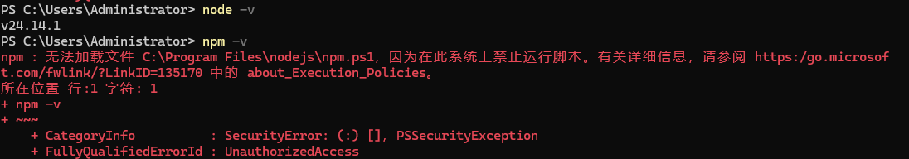

---
tags:
  - vscode-frontend
created: 2026-04-05 07:13:00
---

# <font size=4>Windows + VScode 前端开发环境搭建</font>

<font size=2>

本文档针对 Windows 平台 + VSCode，帮助你快速搭建完整的开发环境。最终目标是实现 LVGL 风格的丝滑 UI（Vite + Svelte 5 Runes + 后端 API）。

</font>

## <font size=3>一、安装 Node.js</font>

### <font size=2>安装</font>

<font size=2>

- 推荐版本：Node.js 22.x 或 24.x LTS（2026 年 4 月当前稳定推荐）
- 下载地址：https://nodejs.org → 选择 LTS 版本（推荐安装 .msi 安装包）
- 安装时必须勾选以下选项：
    - Add to PATH（自动添加环境变量）
    - Automatically install the necessary tools（可选，但推荐）

安装完成后，重启电脑

验证命令（在 VSCode 终端运行）：

```bash
node -v
npm -v
```

这时大概率 `node -v` 会有正常版本显示，但是 `npm -v` 会报错



> [!warning] 问题原因
> 遇到的错误是 Windows PowerShell 执行策略（Execution Policy） 设置为 Restricted（默认最严格模式），导致 PowerShell 禁止运行任何 .ps1 脚本文件（包括 Node.js 自带的 npm.ps1、npx.ps1 等），这是 Windows 新安装 Node.js 后非常常见的权限问题，不会影响 Node.js 本身，只是 PowerShell 终端受限。

```bash
# 在 power shell 中执行下面的指令
Set-ExecutionPolicy -Scope CurrentUser -ExecutionPolicy RemoteSigned

# 再次验证
npm -v
```

解决后，确认 `npm -v` 可以用了之后，安装 pnpm（全局）：

```bash
npm install -g pnpm
```

</font>


### <font size=2>关于 .pnpm-store </font>

<font size=2>

在运行了 `pnpm install` 指令后，会在根目录下产生一个.pnpm-store（或叫 pnpm store），这个不是之前安装的 pnpm 本身，而是 pnpm 用来保存所有依赖包的全局缓存仓库。

正常在C盘安装了Node.js后，会在`C:\Users\Administrator\AppData\Local\pnpm\store\v10`路径下有一个全局的库，但是这个仅限在C盘。如果在 I: 盘（或项目所在盘符）运行过 `pnpm install`，`pnpm` 可能会在 `I:.pnpm-store`创建这个文件夹。

```bash
# 正常全局位置查看
pnpm store path
```

不要手动删除 .pnpm-store（除非你想彻底清理所有缓存）

```bash
# 如果想清理无用包，可以安全执行：
pnpm store prune

# 如果想彻底删除整个缓存（会让下次安装变慢）：
pnpm store prune --force
# 或者手动删除后重新 pnpm install
```

推荐设置统一的 store 目录（避免在项目盘根目录生成 .pnpm-store）

```ini
# 在项目根目录创建一个 .npmrc 文件 

# ==================== pnpm 全局配置 ====================
# 把依赖缓存统一放在 C 盘，防止在项目目录生成 .pnpm-store
store-dir=C:\Users\Administrator\AppData\Local\pnpm\store\v10

# 可选优化（推荐保留）
shamefully-hoist=true
public-hoist-pattern=*

# 如果你在香港，加速下载（推荐加上）
registry=https://registry.npmmirror.com

# 防止 Windows 和 Ubuntu 之间出现路径/大小写问题
force-consistent-casing-in-file-names=true

```

让配置生效，在 power shell 中执行

```bash
# 1. 杀掉正在运行的 Node 进程
taskkill /F /IM node.exe

# 2. 清理旧缓存
pnpm store prune

# 3. 重新安装依赖（让新 store 路径生效）
pnpm install

# 4. 查看现在的路径
pnpm store path
```

</font>


## <font size=3>二、安装 VScode 插件</font>

<font size=2>

（待补充）

</font>
